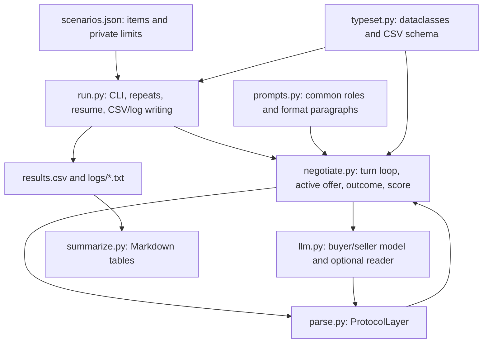

# Week 04 — FIPA-ACL speech acts in price negotiation

This experiment compares how three message formats convey four negotiation acts: `propose`, `accept-proposal`, `reject-proposal`, and `refuse`. A buyer and seller negotiate each used item with private budget and reserve prices. The buyer opens, roles alternate, and an episode lasts at most eight messages. See [REPORT.md](REPORT.md) for the complete results and interpretation.

## Code layout



`negotiate.py` tracks one active offer as `(sender, price)`. A valid counterproposal replaces it; rejection clears a counterpart's offer; only acceptance of the counterpart's active proposal closes a deal. `refuse` closes with `no_deal`; reaching the limit leaves `open`. Parsing errors count as messages but cannot change the active offer. `score()` checks the actual deal price against both private limits. The transport-independent parsing layer can be reused if the message transport changes.

## Run

From this directory, with Python 3.12 and `python-dotenv` installed:

```bash
python -m pip install python-dotenv
export API_KEY="<your key>"
python run.py --provider openai --model gpt-6-luna --replicates 3 \
  --conditions free tagged structured
```

The default `BASE_URL` is `https://api.openai.com/v1`; set it only for a compatible endpoint. The recorded experiment uses `temperature` unset, `reasoning_effort=none` for `gpt-6-luna`, and `MAX_TURNS=8`. `run.py` writes each episode to `results.csv` and its `logs/<condition>-<repeat>.txt` capture, then skips recorded `(run, scenario)` pairs on restart. For a fresh independent run, supply new `--results` and `--logs` paths; reusing the existing files resumes the recorded IDs. The model's outputs can vary across repetitions. The reader uses the same `LLM` instance and model as the negotiating agents.

The three conditions use the same role rules and scenarios. In `free`, every message is classified by a model reader; in `tagged`, a regex reads the leading tag and the reader extracts prices from `propose`; in `structured`, Python parses JSON with no reader call. The 54 recorded episodes cover six scenarios, three repeats, and all three formats. Logs are preserved, including the repeated scenario 4 capture in `free-01` after the CSV header fix.

## Further experiment

The planned Kafka extension will transport the same negotiation acts as events, using conversation and offer identifiers to associate acceptance or rejection with the active proposal. That extension is future work and will be saved in a personal repository; it is not part of these results.
