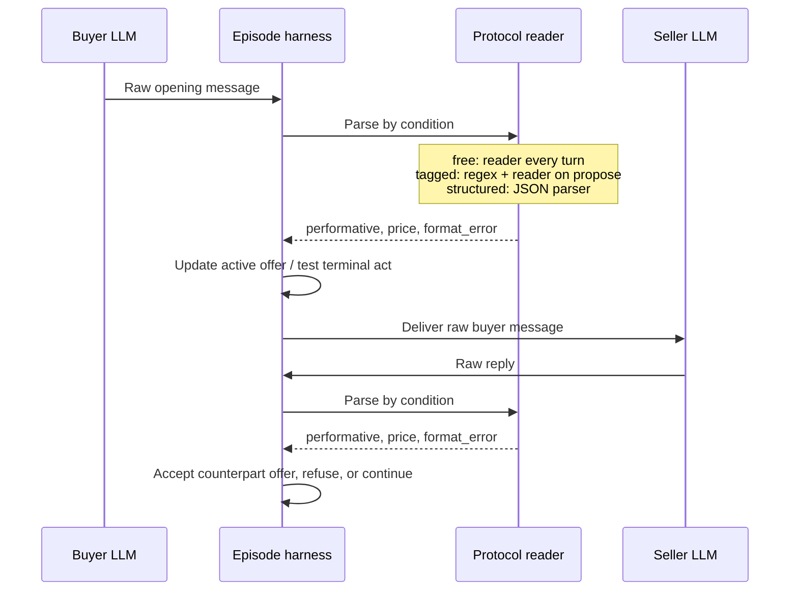

# Report


## FIPA-ACL negotiation formats

## 1. Setup

The buyer and seller negotiate six used goods from `scenarios.json` over at most eight turns. Buyer budget and seller reserve remain private. Four cases allow a deal (scenarios 1, 2, 3, 6); two do not (4, 5). The boundary cases are scenario 3 (reserve = budget = 40) and scenario 5 (reserve 200, budget 198). Each condition has three runs of six scenarios. The only experimental change is the format paragraph and the protocol reader.

| Setting | Recorded value |
|---|---|
| Provider | `openai` through Chat Completions (`BASE_URL` default `https://api.openai.com/v1`) |
| Model | `gpt-6-luna`, also used for the optional reader |
| Temperature | unset (`None`; no temperature parameter sent) |
| Reasoning effort | `none` for `gpt-6-luna` |
| Completion cap | `MAX_TOKENS=2048` per model call |
| Turn limit | `MAX_TURNS=8` messages per episode |
| Repeats | three for each format and scenario, 54 CSV rows total |

The same common rules and role prompts apply in each condition. The three format paragraphs in `prompts.py` are:

**Free**

```text
Message format:
Write one plain English sentence. Do not use tags, JSON, labels, markdown, or the words performative / accept-proposal / reject-proposal / refuse as a heading.
```

**Tagged**

```text
Message format:
Start the line with exactly one tag in square brackets, then one English sentence.
Allowed tags: [propose] [accept-proposal] [reject-proposal] [refuse]
Example: [propose] I can do 30 for this item.
```

**Structured**

```text
Message format:
Reply with a single JSON object and nothing else. No markdown fences.
Schema:
{"performative":"propose"|"accept-proposal"|"reject-proposal"|"refuse","content":{"price":<int>}}
price is required when performative is propose. For accept-proposal put the agreed price.
```

The reader receives the following `READER_PROMPT` in the `free` condition on every message and in the `tagged` condition for the price of each `propose`:

```text
You label one negotiation utterance.
Allowed performatives: propose, accept-proposal, reject-proposal, refuse.
Return ONLY a JSON object, no markdown:
{"performative":"<one of the four or null>","price":<integer or null>}

price is the price THE SPEAKER OF THE LAST MESSAGE is offering or agreeing to.
If the last message is not one of the four acts, return {"performative":null,"price":null}.
If several numbers appear, pick the speaker's own offer, not the counterpart's quoted number.
```

Execution, from `submissions/26512075/week-04/` after installing `python-dotenv` and setting `API_KEY`:

```bash
python run.py --provider openai --model gpt-6-luna --replicates 3 \
  --conditions free tagged structured
```

`run.py` resumes from the existing results file; use fresh `--results` and `--logs` paths for a genuinely new experiment. Repetitions sample fresh model responses, so exact wording and prices may vary.

### Communication structure



The sequence repeats while the episode remains open. The harness stores the raw utterance in both participants' histories, and decides deal price from the counterpart's active offer rather than the acceptance text. Logs and CSV persist each episode.

## 2. Results

All numbers below come from `results.csv` on the `week-04` branch. `correct` counts valid deals when `reserve <= budget`, and `no_deal` when `reserve > budget`; `open` is incorrect in either case. A concluded deal outside the two limits counts as a violation. Counts are totals over 18 episodes per condition; mean turns is messages per episode. There are **no dead episodes in the current CSV**; an `open` outcome is a completed episode that reached its turn limit.

| Condition | Correct | Deal / no_deal / open | Violation | Mean turns | Format errors | Reader calls |
|---|---:|---:|---:|---:|---:|---:|
| free | 17/18 | 12 / 5 / 1 | 0 | 4.83 | 0 | 87 |
| tagged | 14/18 | 8 / 6 / 4 | 0 | 5.50 | 2 | 37 |
| structured | 16/18 | 12 / 4 / 2 | 0 | 4.89 | 0 | 0 |

**Run provenance and CSV repair.** The first attempt reached `free-01` scenarios 1–3 with an earlier CSV header. The run stopped for a header mismatch with the CI contract, and the remaining work was resumed after the header correction. The three carried-over rows initially had an empty `deal_possible` cell despite all three having `reserve <= budget`; those three cells have been filled with `1` from the unchanged `scenarios.json` only for this report. The original CSV file was remained untouched. Their prices, outcomes, and message counts were preserved. `logs/free-01.txt` has two scenario 4 captures from the interruption/restart, while `results.csv` contains one scenario 4 row (the later result). The aggregate uses the 54 CSV rows once each, not every capture in the log. No logged attempt has been removed or counted as a dead episode.

### Every episode in `results.csv`

| run | condition | scenario | deal_possible | outcome | price | correct | violation | turns | format_errors | reader_calls | note |
| --- | --- | --- | --- | --- | --- | --- | --- | --- | --- | --- | --- |
| free-01 | free | 1 | 1 | deal | 150 | 1 | 0 | 3 | 0 | 3 |  |
| free-01 | free | 2 | 1 | deal | 40 | 1 | 0 | 4 | 0 | 4 |  |
| free-01 | free | 3 | 1 | deal | 40 | 1 | 0 | 6 | 0 | 6 |  |
| free-01 | free | 4 | 0 | no_deal |  | 1 | 0 | 7 | 0 | 7 |  |
| free-01 | free | 5 | 0 | no_deal |  | 1 | 0 | 6 | 0 | 6 |  |
| free-01 | free | 6 | 1 | deal | 60 | 1 | 0 | 2 | 0 | 2 |  |
| free-02 | free | 1 | 1 | deal | 120 | 1 | 0 | 4 | 0 | 4 |  |
| free-02 | free | 2 | 1 | deal | 42 | 1 | 0 | 5 | 0 | 5 |  |
| free-02 | free | 3 | 1 | deal | 40 | 1 | 0 | 4 | 0 | 4 |  |
| free-02 | free | 4 | 0 | no_deal |  | 1 | 0 | 7 | 0 | 7 |  |
| free-02 | free | 5 | 0 | no_deal |  | 1 | 0 | 7 | 0 | 7 |  |
| free-02 | free | 6 | 1 | deal | 65 | 1 | 0 | 3 | 0 | 3 |  |
| free-03 | free | 1 | 1 | deal | 150 | 1 | 0 | 3 | 0 | 3 |  |
| free-03 | free | 2 | 1 | deal | 40 | 1 | 0 | 4 | 0 | 4 |  |
| free-03 | free | 3 | 1 | deal | 40 | 1 | 0 | 5 | 0 | 5 |  |
| free-03 | free | 4 | 0 | no_deal |  | 1 | 0 | 7 | 0 | 7 |  |
| free-03 | free | 5 | 0 | open |  | 0 | 0 | 8 | 0 | 8 |  |
| free-03 | free | 6 | 1 | deal | 55 | 1 | 0 | 2 | 0 | 2 |  |
| tagged-01 | tagged | 1 | 1 | open |  | 0 | 0 | 8 | 2 | 1 |  |
| tagged-01 | tagged | 2 | 1 | deal | 30 | 1 | 0 | 2 | 0 | 1 |  |
| tagged-01 | tagged | 3 | 1 | deal | 40 | 1 | 0 | 6 | 0 | 3 |  |
| tagged-01 | tagged | 4 | 0 | no_deal |  | 1 | 0 | 7 | 0 | 4 |  |
| tagged-01 | tagged | 5 | 0 | no_deal |  | 1 | 0 | 7 | 0 | 3 |  |
| tagged-01 | tagged | 6 | 1 | deal | 55 | 1 | 0 | 4 | 0 | 2 |  |
| tagged-02 | tagged | 1 | 1 | open |  | 0 | 0 | 8 | 0 | 1 |  |
| tagged-02 | tagged | 2 | 1 | deal | 35 | 1 | 0 | 2 | 0 | 1 |  |
| tagged-02 | tagged | 3 | 1 | open |  | 0 | 0 | 8 | 0 | 2 |  |
| tagged-02 | tagged | 4 | 0 | no_deal |  | 1 | 0 | 7 | 0 | 3 |  |
| tagged-02 | tagged | 5 | 0 | no_deal |  | 1 | 0 | 4 | 0 | 1 |  |
| tagged-02 | tagged | 6 | 1 | deal | 55 | 1 | 0 | 4 | 0 | 2 |  |
| tagged-03 | tagged | 1 | 1 | deal | 120 | 1 | 0 | 4 | 0 | 2 |  |
| tagged-03 | tagged | 2 | 1 | deal | 30 | 1 | 0 | 2 | 0 | 1 |  |
| tagged-03 | tagged | 3 | 1 | deal | 40 | 1 | 0 | 6 | 0 | 3 |  |
| tagged-03 | tagged | 4 | 0 | no_deal |  | 1 | 0 | 5 | 0 | 2 |  |
| tagged-03 | tagged | 5 | 0 | no_deal |  | 1 | 0 | 7 | 0 | 4 |  |
| tagged-03 | tagged | 6 | 1 | open |  | 0 | 0 | 8 | 0 | 1 |  |
| structured-01 | structured | 1 | 1 | deal | 150 | 1 | 0 | 3 | 0 | 0 |  |
| structured-01 | structured | 2 | 1 | deal | 30 | 1 | 0 | 2 | 0 | 0 |  |
| structured-01 | structured | 3 | 1 | deal | 40 | 1 | 0 | 6 | 0 | 0 |  |
| structured-01 | structured | 4 | 0 | no_deal |  | 1 | 0 | 7 | 0 | 0 |  |
| structured-01 | structured | 5 | 0 | open |  | 0 | 0 | 8 | 0 | 0 |  |
| structured-01 | structured | 6 | 1 | deal | 60 | 1 | 0 | 4 | 0 | 0 |  |
| structured-02 | structured | 1 | 1 | deal | 120 | 1 | 0 | 4 | 0 | 0 |  |
| structured-02 | structured | 2 | 1 | deal | 30 | 1 | 0 | 2 | 0 | 0 |  |
| structured-02 | structured | 3 | 1 | deal | 40 | 1 | 0 | 6 | 0 | 0 |  |
| structured-02 | structured | 4 | 0 | no_deal |  | 1 | 0 | 5 | 0 | 0 |  |
| structured-02 | structured | 5 | 0 | open |  | 0 | 0 | 8 | 0 | 0 |  |
| structured-02 | structured | 6 | 1 | deal | 60 | 1 | 0 | 4 | 0 | 0 |  |
| structured-03 | structured | 1 | 1 | deal | 120 | 1 | 0 | 4 | 0 | 0 |  |
| structured-03 | structured | 2 | 1 | deal | 30 | 1 | 0 | 2 | 0 | 0 |  |
| structured-03 | structured | 3 | 1 | deal | 40 | 1 | 0 | 6 | 0 | 0 |  |
| structured-03 | structured | 4 | 0 | no_deal |  | 1 | 0 | 5 | 0 | 0 |  |
| structured-03 | structured | 5 | 0 | no_deal |  | 1 | 0 | 8 | 0 | 0 |  |
| structured-03 | structured | 6 | 1 | deal | 60 | 1 | 0 | 4 | 0 | 0 |  |

## 3. FIPA-ACL and the three implementations

| Aspect | FIPA-ACL specification | Free | Tagged | Structured |
|---|---|---|---|---|
| Illocutionary force | Explicit `performative` field with communicative-act semantics | Inferred from English and context by an LLM reader | Leading square-bracket tag parsed by regex | Explicit JSON `performative` parsed by code |
| Content language | Declared `:language`, `:ontology`, and proposition/term in `:content`; exact language varies | Plain English price utterance | Plain English after tag | JSON object containing integer `content.price` for `propose` |
| Content interpreter | Agents using the declared content language and ontology | LLM reader labels act and price | Code parses tag; LLM reader extracts proposed price | Python JSON parser extracts proposed price |
| End of conversation | Protocol and communicative-act semantics specify relevant terminal acts; the transport alone does not close a negotiation | Harness ends on accepted active proposal or `refuse`; otherwise at turn 8 | Same harness transitions, with tag determining the act | Same harness transitions, with JSON act determining the act |
| Sincerity | Act semantics define a sincerity condition; an ACL envelope alone does not verify it | Role prompt and post-hoc limit/price score; no guarantee | Same prompt and score; explicit tag can conflict with sentence | Same prompt and score; valid JSON cannot guarantee honest or coherent intent |
| Cost to read one message | Depends on the chosen parser/content language, not a universal model-call price | One extra reader LLM call for every message (87/87) | Regex plus one reader call per parsed `propose` (37/99 messages) | Local JSON parsing, zero reader calls (0/88) |
| Observed failure modes | Mismatch between stated act and content, invalid content, or protocol violation remain possible | Reader can mislabel a counteroffer; one `open` at turn 8 | `[reject-proposal]` sentences containing a new price are treated as rejection; subsequent accepts can be invalid; two tag format errors | Valid JSON still allows unresolved bargaining; two `open` outcomes at turn 8 |

The Python `AclMessage` dataclass includes envelope-like fields, but this run communicates through in-process histories and evaluates the four acts through `ProtocolLayer`; it does not implement a full FIPA-ACL content language, ontology checker, or network transport.

## 4. Interpretation

Explicit tags reduced reader calls from **87** in free to **37** in tagged, and JSON removed them entirely, but the tagged condition also dropped from **17/18** to **14/18** correct and rose from **4.83** to **5.50** mean turns, with **2** format errors. The main mechanism is visible in `logs/tagged-01.txt`: `[seller] [reject-proposal] I can’t accept 100, but I can sell the bicycle for 150.` is followed by `[buyer] [accept-proposal] I accept your offer of 150 for the bicycle.` and `# invalid_accept: no counterpart proposal`. The tag says reject, so the harness clears the old offer and cannot accept the new 150 mentioned only in English; the episode becomes `open`. `logs/tagged-02.txt` repeats the pattern for scenario 3 at 40, and `logs/tagged-03.txt` for scenario 6 at 70. Structured scored **16/18**, with zero reader calls and zero format errors, yet `logs/structured-01.txt` and `logs/structured-02.txt` both end scenario 5 at turn 8 after a final seller `propose` of 200 against a buyer budget of 198. Free scored **17/18**; `logs/free-03.txt` shows its sole failure as a final seller “my price remains 200” read as `reject-proposal`, leaving the negotiation `open` at turn 8. All three conditions recorded **zero private-limit deal violations**. The small sample supports differences in reader cost and in how a tag/content mismatch affects the active-offer state; it does not establish that one format intrinsically improves bargaining quality.

**Further experiment.** A Kafka-based event transport with conversation IDs and proposal IDs is planned for a personal repository. It would make proposal correlation and rejections explicit across asynchronous messages. Kafka was not used in these runs and contributes no rows to the tables above.
