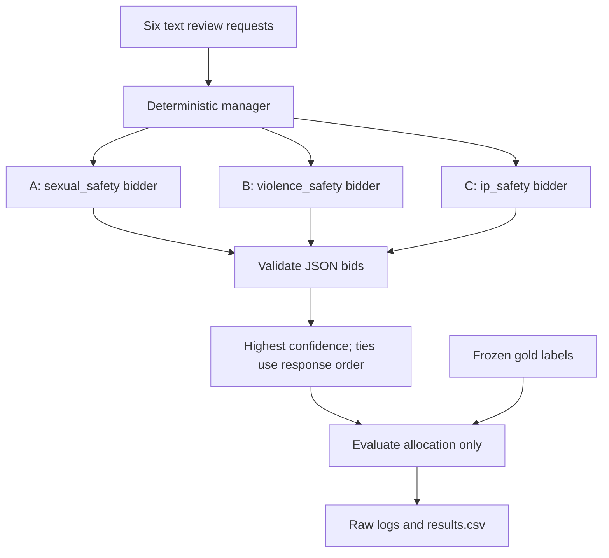

# Week 03: Contract Net for diffusion-safety review routing

Student 26520024 (LeeUichann). This is a text-only allocation experiment, not an
image detector. No images are supplied and no safety or legal verdict is made.
A = sexual_safety, B = violence_safety, C = ip_safety. Six synthetic requests,
two per specialist, are frozen in tasks.json before execution.

## Run in existing conda base

Requires the already authenticated Codex CLI 0.153.0 and Python 3.8+.
This experiment uses the student's existing ChatGPT login, not an extracted API
key. No Python SDK, extra package, GPU, or new conda environment is needed.
No credentials belong in this repository. CODEX_BIN optionally selects the CLI
executable; no model/temperature environment variable overrides are accepted.

```bash
conda activate base
cd /nas/home/uichan/ai-agent-engineering-101/submissions/26520024/week-03
/home/uichan/miniconda3/bin/python -m unittest discover -v
/home/uichan/miniconda3/bin/python run_experiment.py --repetitions 3
/home/uichan/miniconda3/bin/python validate_results.py
cd /nas/home/uichan/ai-agent-engineering-101
/home/uichan/miniconda3/bin/python scripts/check_week03.py submissions/26520024/week-03
```

`--repetitions 3` targets three completed runs per condition. Repeating it after
completion is a no-op. To collect an additional repetition without overwriting
evidence, use `--repetitions 4`. Run only one runner at a time. The runner refuses
uncommitted experiment inputs/code. It stops on a crash and preserves the failed
row with blank counts; diagnose it before resuming. A force-killed process can
leave an unmatched partial log: retain and reconcile it explicitly rather than
deleting it. Normal exceptions and Ctrl-C are captured in the CSV.

## Controlled setup

Exact prompts: [prompts.json](prompts.json). Preregistered rules and limitations:
[DESIGN.md](DESIGN.md). Each task is announced to A, B, C; each independently
returns `bid`, `confidence` (0..100), and `reason`. The manager selects the highest
valid positive bid, breaking ties A before B before C. Only afterward does the
evaluator compare the winner to the hidden gold label.

Baseline assigns three different skills. Homogeneous changes only those skill
strings to one identical generalist skill. Overconfident adds one sentence only
to C's baseline prompt, requesting bids on everything at confidence >=95.
The bidder identities are opaque A/B/C in every condition to avoid specialty
names leaking into homogeneous prompts. Calls use the same model gpt-6-astra,
reasoning effort low, task order and call order throughout.

The CLI adapter embeds the system and user strings in one fixed request. It is
not the direct chat API or a replacement native system message. The CLI retains
its own instruction overhead. Temperature and max output tokens are not exposed
by this adapter; internal values are unknown. This limitation follows the
lecture's explicit instructions for CLI tools without these controls. Runs are
fresh ephemeral invocations with no resumed context or bid JSON output schema.
Native tools are disabled and any reported native tool action invalidates a run.
Raw JSONL model events, final text, stderr, usage, source hashes, CLI version and
exact inputs are retained in logs. No fabricated or hand-edited bids are used.

## Metrics and evidence

`messages = 18 announcements + positive bids + awards` for six complete tasks.
This follows the lecture's code, which excludes declines and malformed replies
from bid messages. It is NOT model-call count or all network traffic. Every
completed run still has 18 model calls. Notes additionally record declines,
parse failures, input/output tokens and wall time. Cached input is included
once in reported input tokens; tokens are usage, not dollar cost. Internal
provider retries, if any, are not application-level bid retries.

`correct + misawards + unassigned = tasks`. Confidence is self-reported, not
calibrated probability. Homogeneous correctness is gold-identity agreement,
not evidence that a generalist could not perform the actual review. The small,
unambiguous task set and fixed condition/tie order limit generalization.

- [REPORT.md](REPORT.md): four-part report of all nine actual runs.
- [results.csv](results.csv): one row per attempted run, including crashes.
- [logs/](logs/): untouched JSON-lines console captures; one file per run.
- [PROCESS.md](PROCESS.md): assistant involvement, decisions and failed attempts.
- `validate_results.py`: replay bids, check prompts and raw events, recompute
  stable-tie awards, usage and CSV counts without another model call.
- `test_contract_net.py`: isolated synthetic tests; never used as result rows.
- `test_validation.py`: temporary evidence fixtures test detection of altered
  results and model replies; no fixture is stored in the submission logs.
- [verification/](verification/): separate offline-test and validation output.

## Measured outcome

All three repeats had the same per-run counts:

| Condition | Correct / 6 | Messages | Misawards |
|---|---:|---:|---:|
| baseline | 6 | 30 | 0 |
| homogeneous | 2 | 42 | 4 |
| overconfident | 6 | 34 | 0 |

All 162 calls completed; no parse failures or unassigned tasks. In homogeneous,
all bidders offered 100 and A won each tie. Overconfident C bid 95 on the other
specialists' tasks; their 100-point bids still won. There was no observed award
degradation from this particular overconfidence instruction, only extra bids.
Total recorded usage: 1,426,479 input tokens and 6,061 output tokens, including
CLI instruction overhead. Aggregate run wall time: 1,107.752 seconds. These are
not direct-API minimal-prompt costs or evidence of general safety robustness.

## High-level structure



## Sources

Assignment: [week-03 README](../../../weeks/week-03/README.md) and
[lecture](../../../week-03.html), especially the manager code and
unavailable-temperature disclosure. Original protocol:
[Smith 1980, author-hosted paper](https://reidgsmith.com/The_Contract_Net_Protocol_Dec-1980.pdf).
The distributed sensing example uses task-specific bid descriptors, not a
universal scalar confidence rule. Our scalar award rule is the course exercise.
