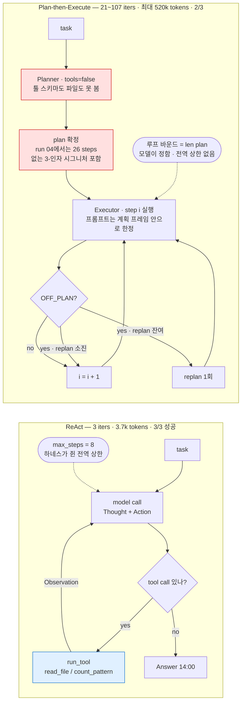
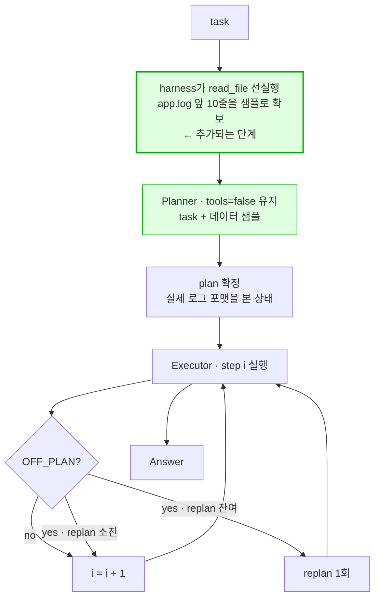

# Week 02 — 하네스 A/B 보고서: ReAct vs Plan-then-Execute

학번 26520057 · 태스크: `app.log`에서 ERROR가 가장 많은 시간대(HH:00) 찾기

---

## 1. 변형 정의

모델·태스크·도구를 상수로 고정하고 하네스만 독립변수로 바꿨다.

### 고정된 조건 (재현에 필요한 전부)

| 항목 | 값 |
|---|---|
| provider | OpenAI (`ANTHROPIC_API_KEY` 미설정 → `tools_shared.PROVIDER = "openai"`) |
| 모델 | `gpt-4o-mini` (`AGENT_MODEL` 미설정 시 기본값), `max_tokens=1024` |
| 도구 | `read_file(path)` — 앞 4000자, `count_pattern(path, pattern)` — 정규식 매칭 줄 수. 두 하네스가 `tools_shared.py`에서 동일하게 import |
| 입력 | `app.log` 60줄 / 3,022자 (수정 없음) |
| 성공 판정 | 최종 답변에 `14:00` 포함 여부. `TASK.md`에 실행 **전** 커밋 (`971f3c4` → 실행 결과는 `6a84f66`) |
| 실행 | `python run_ab.py --runs 3` (하네스당 3회, 총 6회) |

### 다섯 요소 중 다르게 잡은 곳

| 축 | ReAct | Plan-then-Execute |
|---|---|---|
| ① 컨텍스트 관리 | 단일 대화. 모든 Thought/Observation이 한 히스토리에 누적 | **플래너와 실행자 대화 분리**. 플래너는 `tools=False`로 호출되어 툴 스키마도 파일 내용도 보지 못함 |
| ② 도구 granularity | 동일 (`tools_shared.py` 공유) | 동일 |
| ③ 종료 조건 | **`max_steps=8` 전역 상한** + 모델이 tool call 없이 답하면 종료 | **전역 상한 없음.** 루프 바운드가 `len(plan)`이라 모델이 정함. 스텝 내부에만 `max_tool_rounds=3` 지역 상한 |
| ④ 에러 복구 | 에러 문자열이 Observation으로 되돌아와 다음 Thought의 입력이 됨 | `OFF_PLAN` 선언 시 재계획, **`max_replan=1`** 유연성 상한 |
| ⑤ 인간 개입 | `IRREVERSIBLE = set()` → 승인 지점 없음 | 승인 지점 없음 |

**⑤는 이번 실험에서 측정되지 않았다.** 두 하네스의 도구가 모두 읽기 전용이라 승인이 필요한 행동이 존재하지 않고, 6회 실행 모두 `interventions=0`이다. 이 축은 이 도구 집합에서는 변별력이 없다.

### 두 하네스의 루프 구조

**빨간 두 상자가 이 실험의 결론이 가리키는 지점이다.** ReAct는 파란 상자(Observation)를 거친 뒤에 다음 행동을 정하고, Plan-then-Execute는 빨간 상자에서 관찰 없이 전체 계획을 굳힌 뒤 그 계획을 실행한다.

---

## 2. 측정표

`results.csv` 전문:

| run | harness | success | tokens | iters | interventions | note |
|---:|---|:--:|---:|---:|---:|---|
| 1 | react | O | 3,721 | 3 | 0 | |
| 2 | react | O | 3,729 | 3 | 0 | |
| 3 | react | O | 3,740 | 3 | 0 | |
| 4 | plan_exec | **X** | **520,385** | **107** | 0 | replans=1 |
| 5 | plan_exec | O | 67,334 | 21 | 0 | replans=1 |
| 6 | plan_exec | O | 42,755 | 23 | 0 | replans=1 |

| | 성공률 | 토큰 (평균) | 토큰 (범위) | 이터레이션 |
|---|:--:|---:|---|---:|
| ReAct | 3/3 | 3,730 | 3,721 ~ 3,740 (편차 19) | 3 |
| Plan-then-Execute | 2/3 | 210,158 | 42,755 ~ 520,385 (**12배**) | 21 ~ 107 |

로그에서 추가로 센 값:

| run | 툴 호출 | 그중 `0` 리턴 | `read_file` 호출 | 결과 |
|---|---:|---:|---:|:--:|
| plan_exec-04 | 144 | 142 (99%) | 1 | X |
| plan_exec-05 | 38 | 27 (71%) | 1 | O |
| plan_exec-06 | 26 | 0 (0%) | 1 | O |

---

## 3. 해석

**이 태스크에서는 ReAct가 성공률(3/3 대 2/3), 토큰(56배), 이터레이션(7~36배), 그리고 분산 모두에서 이겼다. 그러나 이긴 원인은 "계획을 세우지 않아서"가 아니라 축 ①의 컨텍스트 분리, 즉 계획이 어떤 관찰보다도 먼저 굳는다는 데 있다.** Plan-then-Execute의 플래너는 `tools=False`로 호출되어 툴 스키마도 `app.log`의 실제 포맷도 보지 못한 채 전체 계획을 확정한다. run 04에서 플래너는 존재하지 않는 3-인자 시그니처 `count_pattern('app.log','ERROR','00')`을 00시부터 23시까지 나열한 26스텝 계획을 만들었고, 실행자는 이를 `pattern='ERROR 09'`로 번역했다. 실제 로그는 `09:11:56 ERROR ...` 형식이라 ERROR 앞에 시각이 오므로 이 패턴은 영원히 0을 반환한다. 반면 ReAct는 첫 스텝에서 `read_file`로 포맷을 **본 뒤** `^2026-09-01 14:(.*)ERROR`를 작성해 3회 호출로 끝냈다. 관찰이 행동보다 앞서는지 뒤서는지가 갈랐다.

이 설계 결함은 축 ③과 ④를 통해 비용으로 증폭된다. Plan-then-Execute에는 전역 반복 상한이 없다 — 루프 바운드가 모델이 쓴 `len(plan)`이므로 **모델이 자기 실행 예산을 정한다.** 게다가 `max_replan=1`이 step 1에서 이미 소진되어, 이후 step 21~26에서 `OFF_PLAN`이 반복돼도 탈출 경로가 없었다. 실행자 대화는 리셋되지 않으므로 144개의 툴 결과가 전부 누적된 채 매 호출마다 재전송되어 토큰이 제곱으로 늘었다(107회 호출, 52만 토큰). ReAct의 `max_steps=8`은 하네스가 쥔 상한이고, 이번엔 걸리지도 않았다.

가장 주목할 것은 run 04의 최종 답변이 `00:00`이라는 점이다. `app.log`는 3,022자로 `read_file`의 4,000자 상한보다 작아 **로그 전문이 첫 툴 호출부터 실행자의 컨텍스트 안에 있었다.** 즉 모델은 `14:03 ERROR`를 눈앞에 두고 "이 파일에는 하루 종일 ERROR가 하나도 없다"고 선언했다. 정보가 없어서가 아니라 가진 정보를 무시해서 틀린 것이다. 원인은 증거의 희석으로 보인다 — 컨텍스트의 99%(142/144)가 `-> 0`이고 원문은 그 속에 묻힌 1블록이다. 여기에 실행자가 `"Execute step 23: ..."`이라는 계획 프레임 안에서만 프롬프트를 받으므로 "카운트가 이상하니 파일을 다시 읽자"로 되돌아갈 수 없었고, 실제로 144회 중 143회가 `count_pattern`이고 `read_file`은 첫 1회뿐이었다. 0 리턴 비율이 실패율을 그대로 따라간다(04: 99% X, 05: 71% O이나 OFF_PLAN 5회, 06: 0% 깔끔한 O)는 점이 이 해석을 뒷받침한다.

---

## 4. 기록해 둘 다른 관찰

- **성공한 5·6번도 계획대로 성공한 것이 아니다.** 두 실행 모두 `count_pattern`이 돌려준 값은 0 아니면 19(전체 ERROR 수)였고 시간대별 집계에 실패했다. 정답 `14:00`은 `read_file`이 반환한 원문 60줄을 모델이 컨텍스트에서 직접 읽어 나온 것이다. `results.csv`에는 O로 기록되어 있으나, 계획을 **우회해서** 얻은 성공이다.
- **ReAct의 Thought가 지시대로 나오지 않았다.** 시스템 프롬프트는 모든 툴 호출 앞에 `Thought:` 한 줄을 요구하지만, `gpt-4o-mini`는 1·2스텝에서 텍스트 없이 툴 호출만 반환했고 마지막 스텝에서만 Thought를 썼다(로그당 1줄). Plan-then-Execute는 시스템 프롬프트에 Thought 요구 자체가 없어 0줄이다. ReAct는 패턴일 뿐 모델이 그 패턴을 따른다는 보장이 아니라는 점이 로그로 확인됐다.
---

## 5. 다음 실험 제안 — Plan-with-Observation

3부의 해석이 옳다면, 축 ① 하나만 바꿔 **계획 이전에 관찰을 넣으면** 토큰과 실패가 함께 줄어야 한다. `harness_plan_execute.py`만 수정하고 `tools_shared.py`와 `harness_react.py`는 건드리지 않는다.

변경점은 초록 상자 하나뿐이다. 플래너는 여전히 `tools=false`이므로 **축 ③(종료 조건)과 축 ④(복구)는 baseline과 동일하게 유지**되고, 달라지는 것은 "플래너가 데이터를 보았는가" 하나다. 한 번에 한 축만 움직여야 인과를 주장할 수 있다.

검증 가능한 예측:

| 지표 | baseline | 예측 | 근거 |
|---|---|---|---|
| `0` 리턴 비율 | 04: 99% / 05: 71% | 크게 하락 | 로그 포맷을 본 뒤 패턴을 쓰므로 |
| tokens | 42k ~ 520k | 하락, 분산 축소 | 헛도는 재시도가 줄어들면 컨텍스트 누적도 준다 |
| success | 2/3 | 3/3 | |

**의도적으로 남겨두는 것**: 샘플을 줘도 플래너는 여전히 `count_pattern`의 인자가 2개라는 사실을 모른다. 프롬프트에 시그니처를 명시하지 않고 그대로 두어, 데이터 관찰만으로 3-인자 환각까지 사라지는지 본다. 사라지지 않는다면 "관찰 부족"과 "스키마 부재"가 별개의 실패 원인이라는 뜻이고, 그 자체가 발견이다.
