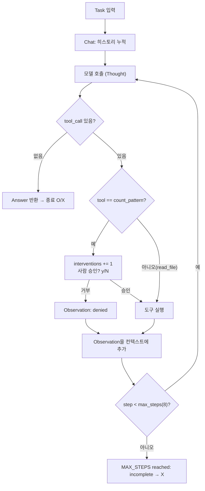
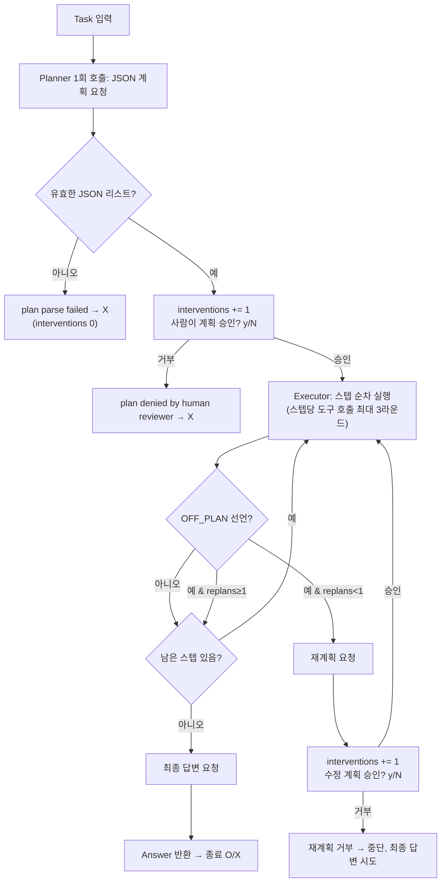

# Week 02 — ReAct vs Plan-then-Execute 하네스 비교

모델·태스크·도구는 고정(공식 스타터의 `tools_shared.py` 공용 모듈, OpenRouter `nvidia/nemotron-3.5-lightning:free`, `app.log`의 시간대별 ERROR 최다 시간 찾기)하고, 하네스만 변경했다.

## 1. 변형 정의

두 하네스는 5축 중 아래처럼 다르게 설정되어 있다. 굵게 표시한 부분은 스타터 기본값에서 이번에 직접 바꾼 설계(디자인 변경 A: 인간 개입 지점)이고, 나머지는 스타터가 원래 그렇게 설계해 둔 부분이다.

| 축 | ReAct (`harness_react.py`) | Plan-then-Execute (`harness_plan_execute.py`) |
|---|---|---|
| 컨텍스트 관리 | Chat 하나에 모든 Thought/Action/Observation이 누적 | Chat 2개(planner, executor)로 분리. planner는 계획 1콜만 보고, executor가 스텝별로 누적 |
| 도구 단위 | `read_file`, `count_pattern` 동일 | 동일 + 스텝당 도구 호출 3라운드 상한(`max_tool_rounds=3`) |
| 종료 조건 | 모델이 tool_call 없이 답하거나 `max_steps=8` 도달 | 계획의 각 스텝을 순서대로 실행 후 최종 답변 요청 |
| 오류 복구 | 도구 예외를 `error: ...` 문자열로 다음 Observation에 피드백 | 스텝이 `OFF_PLAN`을 선언하면 `max_replan=1`까지 재계획, 계획 JSON 파싱 실패는 즉시 실패 |
| **인간 개입 지점** | **`count_pattern` 호출마다 승인 필요(`IRREVERSIBLE={"count_pattern"}`), `read_file`은 자동. 매 문의(승인/거부 무관)가 interventions에 집계** | **계획 전체를 실행 전에 1회 승인, 재계획이 발생하면 수정된 계획도 다시 승인. 도구 호출 단위 게이트는 없음** |

공통 요소: 같은 `tools_shared.py`(모델 호출, `Meter`, 도구 스키마)를 import, 같은 모델(`AGENT_MODEL` 미지정 시 OpenAI 호환 경로의 기본값을 그대로 사용, 실제로는 `AGENT_MODEL=nvidia/nemotron-3.5-lightning:free`로 고정), 같은 `TASK.md`(`app.log`에서 ERROR가 가장 많은 시간, 기대값 `14:00`).

### 하네스 구조 (실제 구현 기준)

## 2. 측정값

`results.csv` 전체 12행 (하네스당 6행, 실패 포함):

| run | harness | success | tokens | iters | interventions | note |
|---|---|---|---|---|---|---|
| 1 | react | O | 3908 | 2 | 0 | |
| 2 | react | O | 3708 | 2 | 0 | |
| 3 | react | O | 10919 | 4 | 2 | |
| 4 | plan_exec | X | 4623 | 1 | 1 | replans=0 (계획 거부) |
| 5 | plan_exec | X | 5862 | 1 | 1 | replans=0 (계획 거부) |
| 6 | plan_exec | X | 2133 | 1 | 1 | replans=0 (계획 거부) |
| 7 | react | O | 4091 | 2 | 0 | |
| 8 | react | O | 3365 | 2 | 0 | |
| 9 | react | O | 4285 | 2 | 0 | |
| 10 | plan_exec | O | 25403 | 8 | 1 | replans=0 |
| 11 | plan_exec | O | 43102 | 13 | 2 | replans=1 |
| 12 | plan_exec | X | 160 | 1 | 0 | replans=0 (계획 JSON 파싱 실패) |

요약(자동 집계):

| 지표 | react (n=6) | plan_exec (n=6) |
|---|---|---|
| 성공률 | 6/6 (100%) | 2/6 (33%) |
| 평균 토큰 (전체) | 5,046 | 13,547 |
| 평균 토큰 (성공만) | 5,046 | 34,253 |
| 평균 iters | 2.3 | 4.2 (성공만 10.5) |
| interventions 합계 | 2 | 6 |

run 4~6과 7~12는 같은 실행을 두 번 나눠 한 것이다: 1차 실행에서 Plan-Execute의 계획 승인 프롬프트 의미를 오해해 3회 모두 거부했고(run 4~6), 이 기록은 지우지 않고 그대로 두었다. 승인 프롬프트를 제대로 이해한 뒤 같은 명령을 다시 실행해 run 7~12를 추가했다.

## 3. 해석

이 태스크에서는 ReAct가 성공률·토큰·반복 횟수 모두에서 Plan-then-Execute를 앞섰는데, 그 이유는 도구 성능 차이가 아니라 두 하네스가 서로 다르게 설정한 축들의 조합에서 나온다. 첫째, 종료 조건과 오류 복구 축의 차이가 토큰 비용을 가른다 — ReAct는 `read_file`로 로그 전체를 한 번 읽은 뒤 모델이 텍스트를 직접 세어 2스텝 만에 끝내는 반면(run 1, 2, 7, 8, 9), Plan-Execute는 스텝별로 `count_pattern`을 반복 호출하다 스텝당 도구 호출 상한(3라운드)에 걸려 `OFF_PLAN`을 선언하고 재계획하는 경로를 타면 반복이 13스텝, 토큰이 43,102까지 치솟는다(run 11). 성공한 두 실행만 비교해도 Plan-Execute 평균 토큰(34,253)이 ReAct(5,046)의 6.8배다. 둘째, 이번에 바꾼 인간 개입 지점 축은 두 하네스에서 실패의 성격 자체를 다르게 만들었다 — ReAct는 개입 지점이 `count_pattern` 호출 단위라 사람이 거부해도 그 한 번의 Observation만 "denied"로 남고 모델이 다른 방법(직접 텍스트 세기)으로 우회할 여지가 있었지만(실제로 6번 중 4번은 `count_pattern`을 아예 호출하지 않고 끝났다), Plan-Execute는 개입 지점이 계획 전체 단위라 사람이 한 번만 거부해도 실행이 시작도 못 하고 그대로 실패한다(run 4~6, 3연속 X). 셋째, run 12는 이 설계 변경과 무관한 별개의 실패 모드다 — planner 호출이 JSON이 아닌 의미 없는 텍스트를 반환해 계획 파싱 자체가 실패했고, 이 경우 인간 승인 게이트에 도달하기도 전에 실행이 끝나(interventions=0) Plan-Execute의 계획 단위 개입 지점이 모델의 출력 형식 준수 여부에 의존한다는 것을 보여준다. 이는 무료 모델의 tool-calling/포맷 안정성 편차로 보이지만(README에도 명시된 알려진 특성), 이 로그 하나로 원인을 확정할 수는 없어 추정으로 남겨둔다.

## 참고: 향후 개선 제안 (이번에 구현·실험한 범위 밖)

수업 말미 논의를 참고한 제안이며, 이번 결과에서 직접 검증한 것은 아니다.

- Plan-Execute의 불필요한 호출·비용 절감: 스텝당 도구 호출 3라운드 상한을 2로 낮추거나, `count_pattern`을 여러 패턴에 나눠 호출하는 대신 한 번의 호출로 여러 시간대를 동시에 집계하도록 도구 자체를 바꾸면 run 11 같은 토큰 폭증을 줄일 수 있을 것으로 보인다.
- ReAct 답변 정확성 검증: 지금은 모델이 로그를 눈으로 세어 답하는데(`count_pattern` 없이), 이 방식은 로그가 길어지면(4000자 상한을 넘으면) 셈이 틀릴 위험이 있다. 최종 답변 전에 `count_pattern`으로 자기 답을 한 번 재검증하도록 시스템 프롬프트를 바꾸는 방안을 다음 실험으로 제안한다.
