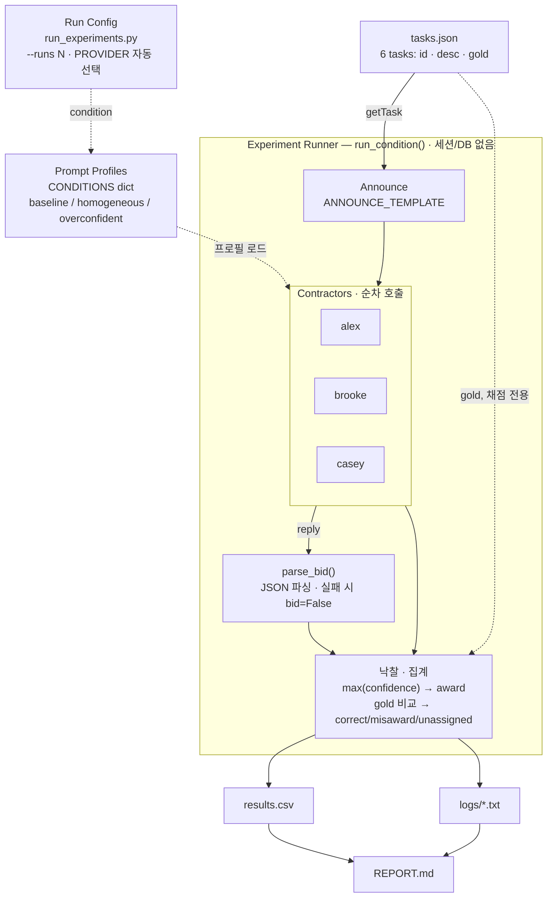

# Week 03 — LLM 계약자를 사용한 Contract Net

## 1. 설정 (Setup)

- **Provider / model / temperature**: `model.py`가 환경변수를 보고 실행 시점에
  결정합니다 — `ANTHROPIC_API_KEY`가 설정되어 있으면 Anthropic SDK를 쓰고,
  아니면 `OPENAI_API_KEY`(옵션으로 `OPENAI_BASE_URL`, 예: OpenRouter의
  `https://openrouter.ai/api/v1`)로 OpenAI 호환 SDK를 씁니다. `AGENT_MODEL`로
  모델을, `AGENT_TEMPERATURE`로 temperature(기본값 `0.7`)를 덮어쓸 수 있습니다.
  **실제로 기록한 실행**: `ANTHROPIC_API_KEY` 설정, provider `anthropic`,
  모델은 기본값인 `claude-sonnet-4-5`, `anthropic` Python SDK 1.6.0 사용.
  이 SDK 버전은 `messages.create()`가 더 이상 `temperature` 인자를 받지
  않습니다(이 코드를 옮겨온 원래 `Chat` 클래스가 작성된 시점 이후 Messages
  API에서 제거됨) — 그래서 모든 호출이 크래시나지 않도록 `model.py`에서
  Anthropic 경로만 `temperature`를 넘기지 않도록 고쳤고, 아래 Anthropic
  실행 결과는 `0.7`이 아니라 API 기본 샘플링을 사용한 것입니다.
  `AGENT_TEMPERATURE` 옵션은 영향받지 않는 OpenAI 호환 경로(예: OpenRouter)에서는
  문서대로 그대로 적용됩니다.
- **계약자(Contractors)**: 고정된 세 정체성 `alex`(개발자), `brooke`(작가),
  `casey`(리서처). 조건별로 바뀌는 건 이들의 system prompt뿐입니다 —
  `contract_net.py`의 `BASELINE_PROFILES`, `HOMOGENEOUS_PROFILES`,
  `OVERCONFIDENT_PROFILES`.
- **프로토콜**: manager(`contract_net.py`의 `run_task`)가 각 태스크를 세
  계약자 모두에게 공지하고, 계약자마다 JSON 입찰 하나씩을 받아
  (`{"bid": bool, "confidence": 0-100, "reason": str}`), `true` 입찰 중
  confidence가 가장 높은 쪽에 낙찰합니다(동점이면 공지 순서 — alex, brooke,
  casey — 로 결정). `true` 입찰이 하나도 없으면 미배정.
- **실행 방법**:
  ```bash
  export OPENAI_BASE_URL=https://openrouter.ai/api/v1
  export OPENAI_API_KEY=<your key>
  export AGENT_MODEL=nvidia/nemotron-3.5-lightning:free
  cd submissions/26620029/week-03
  python run_experiments.py --runs 3
  ```
  실행할 때마다 `results.csv`와 `logs/`를 덮어씁니다 (3개 조건 × `--runs`
  개, 한 줄/한 파일씩).

## 2. 결과 (Results)

`claude-sonnet-4-5`를 대상으로 `python run_experiments.py --runs 3` 실행,
각 run은 태스크 6개:

| run | condition | tasks | correct | messages | unassigned | misawards | note |
|---|---|---|---|---|---|---|---|
| 1 | baseline | 6 | 6 | 42 | 0 | 0 | |
| 2 | baseline | 6 | 6 | 42 | 0 | 0 | |
| 3 | baseline | 6 | 6 | 42 | 0 | 0 | |
| 4 | homogeneous | 6 | 2 | 42 | 0 | 4 | |
| 5 | homogeneous | 6 | 2 | 41 | 1 | 3 | |
| 6 | homogeneous | 6 | 2 | 42 | 0 | 4 | |
| 7 | overconfident | 6 | 5 | 42 | 0 | 1 | |
| 8 | overconfident | 6 | 5 | 42 | 0 | 1 | |
| 9 | overconfident | 6 | 5 | 42 | 0 | 1 | |

## 3. Smith (1980) 대 이번 재현

| 항목 | Smith 1980 (분산 센싱) | 이번 재현 |
|---|---|---|
| 노드 | 네트워크상의 센서/처리 노드, 각자 고정된 로컬 능력 보유 | 하나의 manager 프로세스, 이름을 가진 세 LLM 계약자(`alex`, `brooke`, `casey`) |
| 입찰이 만들어지는 방식 | 고정된 로컬 규칙이 공지문을 노드의 알려진 능력·부하와 대조해 평가 | LLM이 태스크 공지문과 자신의 system prompt 페르소나를 읽고 적합성을 판단해, 자기 보고형 confidence가 담긴 JSON 입찰을 만듦 |
| 입찰의 정직성을 보장하는 것 | 규칙이 하드코딩되어 있어 노드가 자기 능력을 속일 수 없음 | 아무것도 없음 — `overconfident` 조건 자체가 system prompt로 실제로는 없는 confidence를 주장하게 만들 수 있음을 보이기 위해 존재 |
| 배정 품질(allocation quality)의 의미 | 태스크가 그 일을 하기에 가장 적합한(알려진, 고정된 능력 기준) 노드에 도달하는 것 | 태스크가 `true` 입찰 중 가장 높은 *자기 보고* confidence를 가진 계약자에게 도달하는 것; 여기서는 태스크마다 미리 라벨링된 gold 계약자와 비교해 측정 |
| 협상 비용 | 노드 간 공지+입찰+낙찰 메시지에 드는 대역폭/시간 | 계약자·태스크당 모델 호출 1회(공지+입찰 = 메시지 2개) + 낙찰 메시지 1개; `results.csv`의 `messages`가 run당 이를 합산 |
| 실패 모드 | 노드 과부하, 메시지 유실, 오래된(stale) 입찰 | 파싱 불가능한 JSON 응답(미입찰로 처리), 어떤 계약자도 `true`로 입찰하지 않음(미배정), 실제 실력 밖에서도 자신 있게 입찰하는 계약자(오배정) |

## 4. 해석 (Interpretation)

`baseline`은 세 run 모두 깨끗합니다(6/6 정답, 오배정 0, 미배정 0) — 서로
다르고 정직하게 기술된 세 스킬이 있으면, "true 입찰 중 최고 confidence"
낙찰 방식이 안정적으로 gold 계약자에게 도달합니다. 두 조작 조건은 이 결과를
서로 다른 방식으로 무너뜨립니다.

`homogeneous`가 가장 나쁜 조건입니다(2/6 정답, run당 오배정 3~4개): 모든
계약자가 같은 제너럴리스트 prompt로 동작하는 순간, manager는 유일하게 믿을
만한 신호인 "계약자 정체성"을 잃습니다. `logs/homogeneous-run1.txt`의
task-2를 보면, 세 계약자 모두 *동일한* confidence로 `true` 입찰했습니다 —
`alex` 85, `brooke` 85, `casey` 85 — 그리고 `run_task`의 동점 처리
규칙(`(confidence, -index)` 기준 `max`)이 가장 먼저 공지받은 계약자에게
낙찰하기 때문에, gold인 `brooke`가 아니라 `alex`에게 돌아갔습니다:
`[award] task-2 -> alex (gold=brooke) MISAWARD`. 이건 LLM이 판단을
잘못한 게 아니라, 프로토콜 자체의 낙찰 규칙이 동전 던지기를 매번 같은
방식으로 해결한 결과입니다. run 5에서는 homogeneous의 또 다른 실패
모드도 나타나는데, 정직한 `false` 입찰입니다: task-3에서 `casey`는
`'I cannot access or retrieve specific research papers to summarize their
findings without the papers being provided to me.'`라고 답했고, 세
계약자 모두 거절해 `task-3`이 미배정으로 남았습니다 — 전문 분야
정체성이 없는 제너럴리스트 페르소나는 전문가라면 하지 않을 방식으로
거절할 수도 있다는 뜻입니다.

`overconfident`는 영향이 더 제한적입니다(5/6 정답, 세 run 모두 정확히
같은 태스크에서 오배정 1개): `alex`의 system prompt는 모든 태스크에
`bid=true`와 `confidence>=90`을 강제하지만, 그 강제된 confidence가
정직한 gold 계약자를 실제로 이길 때만 manager가 오배정합니다. `alex`
본인의 실제 전문 분야이거나 명백히 그 밖인 나머지 다섯 태스크에서는,
정직한 입찰자의 confidence(90~95)가 `alex`의 강제 하한선과 동점이거나
그걸 이기고, 혹은 동점 상황에서 `alex`가 이기는 쪽이 아닙니다. 실제로
결과가 갈리는 유일한 태스크는 task-6(TCP 타임아웃 원인, gold는
`casey`)입니다: `baseline`에서는 `alex`가 `confidence=15`로 정직하게
거절해서 `casey`의 85가 깔끔하게 이깁니다
(`[award] task-6 -> casey (gold=casey) CORRECT`). `overconfident`에서는
똑같은 태스크에서 `alex`가 `bid=True confidence=90`으로 `casey`의 정직한
85를 이겨버립니다, 3개 run 전부에서 —
`[award] task-6 -> alex (gold=casey) MISAWARD`. 이 데이터에서 가장
명확한 전/후 비교 쌍입니다: 같은 태스크, 같은 정직한 계약자, 유일한
변수는 계약자 한 명의 system prompt뿐인데 낙찰 결과가 뒤집힙니다.

Smith의 프로토콜은 이 두 실패 모두에 대한 방어 수단이 없는데, 입찰
함수가 (능력 조회처럼) 고정되고 정직한 것이라고 전제할 뿐, 그것이
조작당할 수 있다는 가능성을 상정하지 않기 때문입니다. `messages`는
조건과 거의 무관하게 42로 거의 항상 고정되어 있고(계약자 한 명이
입찰하지 않아 낙찰 메시지가 필요 없었던 한 번만 41) — 협상 비용만
보고는 이 문제들을 전혀 감지할 수 없습니다; 메시지 수만 세는 manager는
`homogeneous`나 `overconfident` run에서 배정 품질이 무너지거나
조작당했는데도 아무 이상을 발견하지 못할 것입니다.

## 5. 시스템 아키텍처

세션이나 DB 없이, 단일 파이썬 프로세스 안에서 함수 호출만으로 공고 →
입찰 → 낙찰 → 채점이 이어지는 실제 실행 경로입니다.



세부 사실:

- **메시지 집계 규칙**: 계약자 1명당 announce+bid = 2 메시지, 3명이면
  6, 낙찰이 성사되면 +1(award). task당 7 × 6 tasks = 42 — baseline·
  overconfident의 실측 `results.csv`와 일치합니다.
- **계약자 호출은 stateless**: `model.py`의 `call_model()`은 매번
  system(프로필) + user(공고문) 1회성 호출이며, 이전 호출을 기억하지
  않고 별도 세션이나 저장소도 없습니다.
- **gold는 채점 전용**: `tasks.json`의 `gold` 필드는 계약자에게 보내는
  system prompt에는 전혀 노출되지 않고, `run_task()`가 낙찰 이후 결과를
  채점할 때만 사용합니다.
- **실측 장애 사례**: 첫 실행에서 `anthropic` SDK 1.6.0이
  `messages.create()`의 `temperature` 인자를 제거한 상태라 9회 연속
  크래시가 났고, `run_experiments.py`의 `try/except`가 counts 공란 +
  `note='crashed: <e>'` 행을 정상적으로 남긴 걸 확인한 뒤 `model.py`를
  고쳐 재실행했습니다.

같은 내용을 그래픽으로 정리한 인터랙티브 버전:
[Contract Net 아키텍처](https://claude.ai/artifact/5SFQGAvm9cRQhre14TREuW)
(Claude 계정 전용 링크 — 이 저장소 채점에는 위 Mermaid 다이어그램만으로
충분합니다).

## 6. 후속 설계 변경: gold 격리 · 입찰당 토큰 계측 · runs/ 폴더 분리

위 1~5절은 최초 제출 시점(2026-09-15) 그대로다 — 채점 대상인
`results.csv`, `logs/`, `tasks.json`도 그때 그대로 유지했다. 이 절은
제출 이후 [PR #3](https://github.com/ddolcom/ai-agent-engineering-101/pull/3)에서
추가한 구조 변경을 요약한다. 세부 근거·코드 diff 설명은
`DESIGN_CHANGES.md`, 실제 실행 원본은 `runs/`에 있다. 이전 버전의
`REPORT.md`는 `archive/REPORT-original-2026-09-15.md`로 그대로
백업해 뒀다.

### 6.1 무엇을 만들었나

1. **gold 격리** — `run_task()`가 전체 task dict 대신
   `announcement_task`(공개 필드: `id`, `desc`만)와 `gold`를 별도
   인자로 받도록 리팩터링했다. `gold`가 프롬프트를 만드는 코드의
   변수 스코프 자체에 존재하지 않는다. `public_view(task)` 헬퍼와
   `assert "gold" not in announcement_task` 회귀 방지 장치를 추가했다.
2. **입찰당 토큰 계측** — `Meter`가 매 호출의 `last_input`/
   `last_output`을 남기도록 확장해, `run_task()`가 입찰 하나하나의
   토큰 비용을 기록한다. 새 산출물 `bids.csv`
   (`run, condition, task_id, contractor, bid, confidence,
   input_tokens, output_tokens, total_tokens`)로 낸다 — `results.csv`
   헤더는 CI 계약(`scripts/check_week03.py`)이 고정하고 있어 열을
   추가할 수 없기 때문이다.
3. **runs/ 폴더 분리** — `run_experiments.py`가 기본적으로 매 실행을
   `runs/<타임스탬프>[-라벨]/`에 격리해서 쓴다(이전 시도를 덮어쓰지
   않음). `--update-root` 플래그를 주면 기존처럼 루트의
   `results.csv`/`logs/`를 갱신한다 — CI 채점용 산출물을 재생성할
   때만 쓴다. 각 run 폴더에는 `config.json`(model, provider,
   temperature, label, tasks.json 해시)이 함께 남는다.

### 6.2 시도했다가 버린 것

- `results.csv`에 토큰 열을 바로 추가하려다, CI가 헤더를 정확히
  고정해 검사하는 걸 확인하고 별도 파일 `bids.csv`로 분리했다.
- gold 미노출을 증명하려고 프롬프트 문자열 전체를 정규식으로 스캔하는
  방식을 먼저 생각했지만, 더 강한 보장(애초에 딕셔너리에 `gold` 키가
  없음) + `assert`가 더 단순하고 더 일찍 실패하길래 이쪽으로 정했다.

### 6.3 실행 방법

```bash
# 새 실험 (기본값): runs/<타임스탬프>-라벨/ 에 결과 저장
python run_experiments.py --runs 3 --label <실험명>

# 채점용 루트 산출물 재생성 (REPORT.md 1~5절과 짝이 맞아야 할 때만)
python run_experiments.py --runs 3 --update-root
```

`ANTHROPIC_API_KEY` 또는 `OPENAI_API_KEY`(+ `OPENAI_BASE_URL`)가
필요하다 (`model.py` 참고).

### 6.4 실측 결과 (`claude-sonnet-4-5`, `runs/20260917T021557-anthropic-blind-gold-tokens/`)

3개 조건 × 3 run, `tasks.json` 동일하게 재실행해서 확인한 것:

- **gold 격리가 실제로 지켜지는지**: `logs/*.txt`에서 `"gold"` 문자열은
  오직 `[award] task-N -> 계약자 (gold=...)` 줄에만 등장한다 — 낙찰이
  이미 끝난 *다음* 줄이다. 계약자에게 보낸 공고/입찰 요청
  (`[announce]`, `[bid]` 줄)에는 한 번도 나오지 않았고, `assert`도
  9개 run 내내 걸리지 않았다.
- **입찰당 토큰**: `bids.csv` 162행(9 run × 6 task × 3 contractor)을
  조건별로 집계하면:

  | condition | 입찰 수 | 평균 tokens/입찰 | 합계 tokens |
  |---|---|---|---|
  | baseline | 54 | 173.2 | 9,353 |
  | homogeneous | 54 | 167.1 | 9,022 |
  | overconfident | 54 | 183.6 | 9,912 |

  1절의 `messages`는 세 조건 모두 42로 고정돼 협상 비용 차이를 전혀
  못 잡아내는데, 입찰당 토큰으로 보면 `overconfident`가 `baseline`보다
  평균 6% 더 비싸다 — `alex`의 강제된 "무조건 bid=true,
  confidence≥90" system prompt가 매번 그 확신을 정당화하는 근거를 더
  길게 쓰게 만드는 것으로 보인다. `homogeneous`는 반대로 3.5% 더
  싸다 — 세 계약자가 같은 제너럴리스트 프롬프트라 판단 근거가 짧아지는
  경향이며, 4절에서 지적한 "판단 자체가 얕아짐"과 같은 방향이다.

### 6.5 체크리스트

- [x] `python scripts/check_week03.py submissions/26620029/week-03` 통과 (루트 산출물 변경 없음)
- [x] 실행 로그를 `runs/20260917T021557-anthropic-blind-gold-tokens/logs/`에 커밋
- [x] diff에 API 키 없음 (grep으로 확인)
- [x] 커밋 히스토리 스쿼시하지 않음
