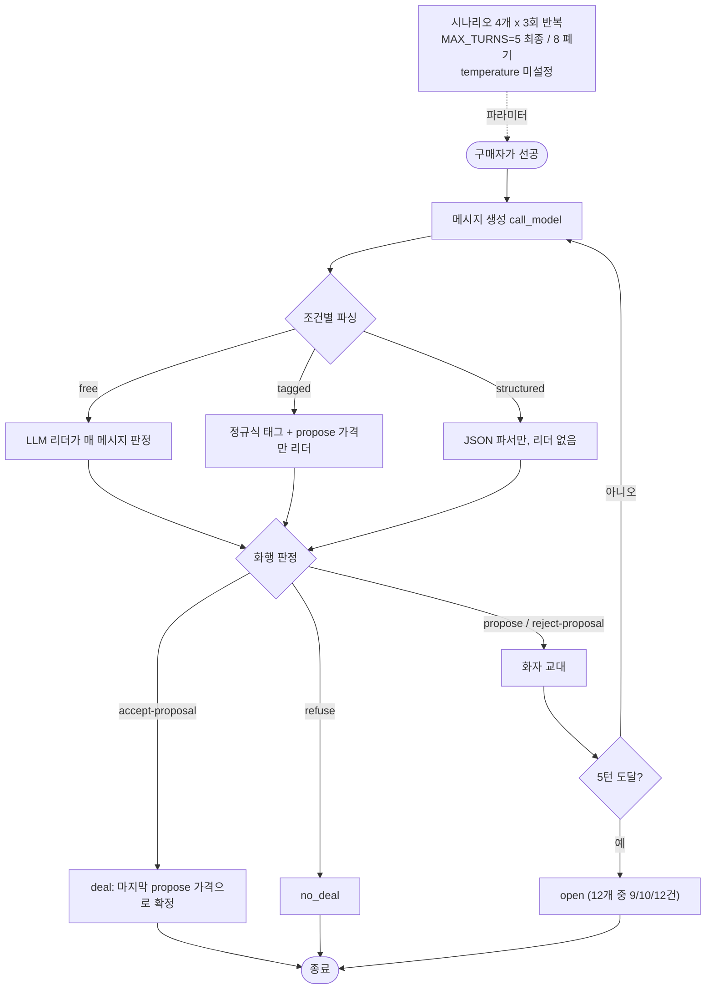
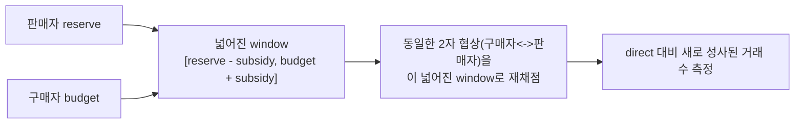
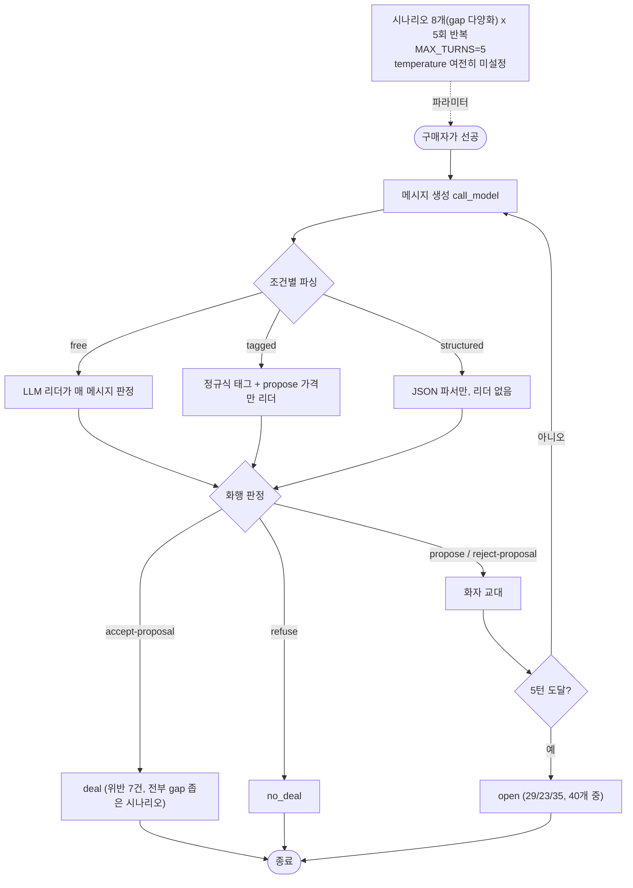
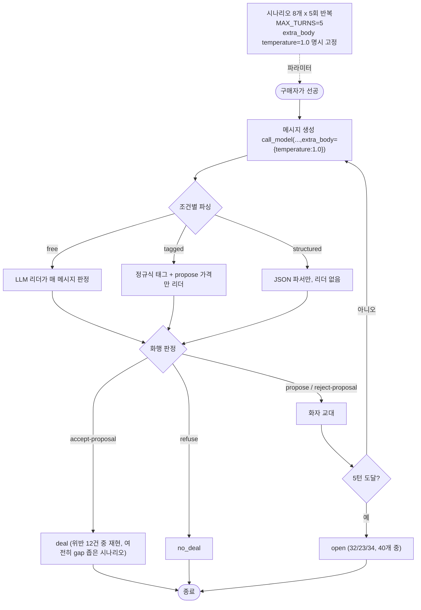
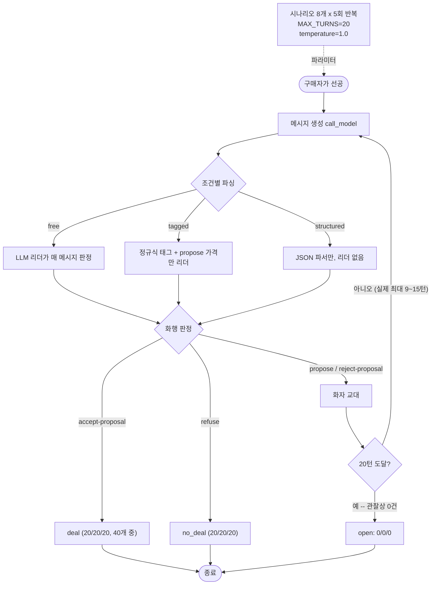
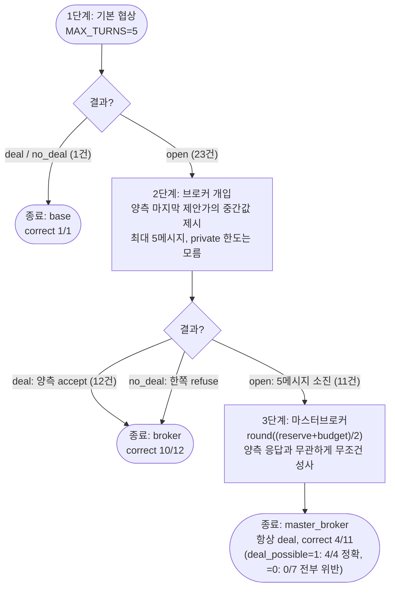

# Week 04 — 실전 화행(speech act): 자유(free) / 태그(tagged) / 구조화(structured) 협상

이 문서는 지금까지 진행한 **모든 실험을 시간 순서대로 구분**해서 기록한다. 핵심 코드
([model.py](model.py), [protocol.py](protocol.py), [negotiation.py](negotiation.py),
[run.py](run.py))는 실험 1~4 동안 그대로거나 파라미터만 바뀌었고, 실험 5에서 처음으로 프로토콜
자체(브로커 개입)가 추가됐다.

## 실험 개요

| # | 실험 | 시나리오 | 반복 | MAX_TURNS | temperature | 결과 폴더 |
|---|---|---|---|---|---|---|
| 1 | 최초 제출 | 4개 | 3회 | 5(최종)/8(폐기) | 미설정(SDK 기본값) | (git 이력, [`_old_maxturns8/`](_old_maxturns8/)) |
| 2 | 시나리오 확장 | 8개 | 5회 | 5 | 미설정 | [`_old_no_temperature_control/`](_old_no_temperature_control/) |
| 3 | temperature 고정 | 8개 | 5회 | 5 | 1.0 (명시) | [`_old_maxturns5/`](_old_maxturns5/) |
| 4 | 턴 제한 확대 | 8개 | 5회 | 20 | 1.0 | [`_old_maxturns20/`](_old_maxturns20/) |
| 5 | 브로커 에스컬레이션 (최종) | 8개 | 1회 | 5(+브로커 5) | 1.0 | [`extra_broker_escalation/`](extra_broker_escalation/) |

현재 [`results.csv`](results.csv)/[`logs/`](logs/)(채점 대상)는 **실험 3과 동일한 설정**(8시나리오,
5반복, MAX_TURNS=5, temperature=1.0)으로 복원되어 있다 — 실험 4에서 턴 제한을 20으로 올렸다가, 이번
라운드에서 다시 5로 되돌렸기 때문이다.

---

## 실험 1 — 최초 제출 (다른 컴퓨터에서 수행)

**조건**: 시나리오 4개(사과 gap+10, 자전거 gap−40, 파인애플 gap+20, 노트북 gap−15), 조건당 3회 반복,
`MAX_TURNS=5`(최종 선택), temperature는 설치된 SDK가 `Messages.create()`에 노출하지 않아 미설정
(그때는 이것이 "SDK/모델이 temperature를 지원하지 않는다"고 잘못 기록됐었다 — 실험 3에서 정정).
`MAX_TURNS=8`로 먼저 돌려봤다가 폐기하고 5로 확정한 시도가 [`_old_maxturns8/`](_old_maxturns8/)에
남아있다.

**결과**:

| condition | n | deal | no_deal | open | correct | violations | mean turns |
|---|---|---|---|---|---|---|---|
| free | 12 | 2 | 1 | 9 | 7/12 | 1 | 4.67 |
| tagged | 12 | 2 | 0 | 10 | 7/12 | 1 | 4.92 |
| structured | 12 | 0 | 0 | 12 | 6/12 | 0 | 5.00 |

(폐기된 MAX_TURNS=8 버전은 참고용으로: free 10/12 correct·1위반, tagged 8/12 correct·4위반, structured
12/12 correct·0위반 — 턴을 늘리면 결과가 크게 바뀐다는 조짐이 이미 여기서 보였다.)

표본이 조건당 12 episode뿐이라 위반이 우연인지 패턴인지 판단하기 어려웠던 것이 실험 2의 동기가 됐다.



### 부록 1-A — 브로커 보조금 탐구 (`extra_broker/`, 비채점)

실험 1과 함께 제출된 별도 탐구. **실험 5의 "대화형 브로커"와는 다른 개념**이다: 대화에 실제로
끼어드는 제3자가 아니라, 판매자·구매자 양쪽에 각각 최대 20의 보조금을 줄 수 있다고 가정하고
협상 가능 구간(window)을 `[reserve−subsidy, budget+subsidy]`로 넓힌 뒤, **같은 2자 협상**을 그
넓어진 window로 재채점하는 방식이다. `structured` 조건·`MAX_TURNS=10`으로 6개 시나리오를 테스트했다.



---

## 실험 2 — 시나리오 확장 (이 세션 1차 작업)

**조건**: 조건당 12 episode로는 위반이 우연인지 확인할 수 없어, gap(=budget−reserve) 크기가 다양한
시나리오 4개(우산 +2, 손목시계 −2, 중고차 +300, TV −200)를 추가해 8개로, 반복을 3→5회로 늘렸다.
`MAX_TURNS=5`, temperature는 여전히 미설정.

**결과**:

| condition | n | deal | no_deal | open | correct | violations | mean turns |
|---|---|---|---|---|---|---|---|
| free | 40 | 6 | 5 | 29 | 23/40 | 3 | 4.70 |
| tagged | 40 | 9 | 8 | 23 | 25/40 | 4 | 4.78 |
| structured | 40 | 5 | 0 | 35 | 25/40 | 0 | 4.88 |

위반 7건 전부가 gap이 좁은 시나리오(+2, +10, +20)에만 몰려 처음으로 "gap 크기가 위반을 좌우한다"는
가설이 세워졌다.



---

## 실험 3 — temperature 명시적 고정

**조건**: "SDK가 temperature를 지원하지 않는다"는 실험 1·2의 기록을 검증한 결과, 설치된 SDK(실제
1.8.0)가 `Messages.create()`의 타입 인자에서만 뺐을 뿐 API 자체는 `extra_body`로 여전히 받는다는
것을 확인([model.py](model.py)). API 기본값인 `1.0`을 `extra_body={"temperature": 1.0}`로 명시
고정하고 동일한 8시나리오·5반복·`MAX_TURNS=5`를 재실행했다.

**결과**:

| condition | n | deal | no_deal | open | correct | violations | mean turns |
|---|---|---|---|---|---|---|---|
| free | 40 | 5 | 3 | 32 | 20/40 | 5 | 4.88 |
| tagged | 40 | 10 | 7 | 23 | 23/40 | 7 | 4.90 |
| structured | 40 | 6 | 0 | 34 | 26/40 | 0 | 4.85 |

temperature를 통제해도 위반은 여전히 같은 세 시나리오(gap +2/+10/+20)에만 몰렸다(이번엔 5→7건으로
더 늘었을 뿐) — gap 크기 효과가 temperature 미고정 때문에 생긴 우연이 아니었음을 재확인했다.



---

## 실험 4 — 턴 제한 확대 (MAX_TURNS 5 → 20)

**조건**: 실험 1~3 모두 대다수 episode가 `open`으로 끝나, 이것이 포맷의 문제인지 단지 5턴이 부족해서
인지 구분할 수 없었다. `MAX_TURNS`를 20으로 올려 동일한 8시나리오·5반복·temperature=1.0으로
재실행했다.

**결과**:

| condition | n | deal | no_deal | open | correct | violations | mean turns | max turns |
|---|---|---|---|---|---|---|---|---|
| free | 40 | 20 | 20 | **0** | 37/40 | 3 | 6.85 | 9 |
| tagged | 40 | 20 | 20 | **0** | 28/40 | 12 | 5.72 | 9 |
| structured | 40 | 20 | 20 | **0** | **40/40** | **0** | 9.25 | 15 |

관찰된 최대 턴 수(9/9/15)가 20에 전혀 못 미쳤는데도 `open`이 완전히 사라졌다 — 실험 1~3의 "대부분
open으로 끝난다"는 결과는 포맷의 성질이 아니라 **턴 제한이 짧아서 생긴 인공물**이었다. structured는
시간을 넉넉히 주자 40/40 완벽한 정확도·위반 0건을 달성했고(대신 평균 9.25턴로 가장 느림), tagged는
오히려 위반이 늘었다(7→12건 — 턴이 길수록 화행 태그를 잘못 붙일 기회도 늘어나기 때문).



---

## 실험 5 (최종) — 브로커 에스컬레이션 + 마스터브로커

**동기**: 실험 4가 "턴만 넉넉하면 결국 다 끝난다"는 걸 보였지만, `MAX_TURNS`를 실제 그레이딩
설정인 5로 되돌린다면 다시 대다수가 `open`으로 남는다(실험 3). 그 막힌 협상을 사람이 흔히 그러듯
**제3자 중개**로 풀 수 있는지, 그래도 안 풀리면 **강제 타결**로 마무리하는 것이 어떤 결과를 내는지
알아본 마지막 탐구다.

**조건**: `negotiation.py`의 `MAX_TURNS`를 20 → **5로 원복**([negotiation.py](negotiation.py)).
graded 시나리오 8개 × 3조건 × **1회 반복**(24 base episode — 반복 통계보다 메커니즘이 모든
시나리오·조건 조합에서 작동하는지 확인하는 게 목적이라 범위를 줄였다) 전부에 대해:

1. **1단계(base)**: 기존과 동일한 `MAX_TURNS=5` 구매자-판매자 협상. `deal`/`no_deal`이면 종료.
2. **2단계(브로커)**: 1단계가 `open`으로 끝난 경우만. 양측의 private한 reserve/budget을 전혀 모르는
   중립 브로커가, 1단계 대화에서 **양측이 실제로 말한 마지막 제안가의 중간값**을 계산해 제안한다.
   1단계의 실제 대화 기록을 그대로 이어받아(`negotiation.py`가 이제 `buyer_history`/`seller_history`
   /`buyer_last_offer`/`seller_last_offer`도 반환하도록 확장 — [negotiation.py](negotiation.py)),
   양측에게 그 가격에 accept-proposal/reject-proposal로만 답하게 한다. 한쪽이라도 `refuse`하면
   즉시 `no_deal`. 브로커의 메시지 예산은 **총 5메시지**(자신의 제안 + 양측 응답 포함)로 제한되며,
   거절당하면 거절한 쪽으로 가격을 조금씩 옮겨 재시도한다.
3. **3단계(마스터브로커)**: 2단계도 `open`(5메시지 소진, 아무도 수락도 거절도 안 함)으로 끝난 경우만.
   브로커와 달리 양측의 **진짜 reserve/budget**을 알고 있는 상위 권한자가 `round((reserve+budget)/2)`
   를 최종가로 선언하고, 양측이 뭐라고 답하든 **무조건** 그 가격에 거래를 성사시킨다 — "성사될 때까지
   진행"을 이 단계는 재시도 루프가 아니라 **항상 1회 만에 확정되는 설계**로 만족시킨다.

**결과** (24 episode, [`extra_broker_escalation/results_escalation.csv`](extra_broker_escalation/results_escalation.csv)):

| 종료 단계 | episode 수 | correct | violation |
|---|---|---|---|
| base | 1 | 1/1 | 0 |
| broker | 12 | 10/12 | 2 |
| master_broker | 11 | 4/11 | 7 |
| **전체** | **24** | **15/24** | **9** |

에스컬레이션 단계가 깊어질수록 정확도가 급격히 떨어진다(100% → 83% → 36%). 특히 마스터브로커
11건 중 **deal_possible=1인 4건은 전부 정확**(강제가가 이미 `[reserve,budget]` 안에 있으므로
구조적으로 안전)하고, **deal_possible=0인 7건은 전부 위반**(애초에 두 한도를 동시에 만족하는 가격이
없으므로 강제 성사는 정의상 위반) — 메커니즘이 정확히 설계대로 작동했다:

```
[master-broker->buyer] forced price 112 | buyer replies: refuse
[master-broker->seller] forced price 112 | seller replies: refuse
-> MASTER BROKER FORCES DEAL at 112 (unconditional)   # 노트북, reserve=120/budget=105 (불가능)
```

브로커(2단계) 자체도 위반에서 자유롭지 않았다 — `tagged`의 파인애플(gap+20)에서 판매자가 브로커의
69원 제안에 스스로 `accept-proposal`했지만 69는 자신의 reserve(70)보다 낮다. 브로커가 강요한 게
아니라 **에이전트가 자기 한도 이하로 자발적으로 동의**한 경우로, 좁은 gap에서 에이전트 스스로도
실수한다는 실험 2·3의 관찰과 같은 종류의 실패다.



---

## FIPA-ACL 대 세 조건 (실험 1~4의 공통 프로토콜 기준)

| | FIPA-ACL (2002) | free | tagged | structured |
|---|---|---|---|---|
| 발화수반력이 있는 곳 | 필수 `performative` 필드, 내용과 분리 | 명시적으로 없음 — 문장에서 추론 | 발화자가 직접 쓰는 괄호 태그 | JSON의 `performative` 필드 |
| 내용 언어 | 선언된 형식 온톨로지 | 자유 영어 산문 | 자유 영어 산문 | 고정 2필드 JSON 스키마 |
| 내용을 해석하는 주체 | 수신 에이전트 | 매 메시지 LLM 리더 | 태그는 정규식, propose 가격만 리더 | JSON 파서, 모델 호출 없음 |
| 대화 종료 방식 | 프로토콜이 정의 | accept-proposal / refuse / 턴 제한 | 동일 | 동일 |
| 진실성(sincerity) 보장 | 형식적으로 없음 | 없음 — 리더 라벨을 신뢰 | 없음 — 태그를 신뢰 | 위반 없음(4·5실험) — 가격 갱신이 구조적으로 안전 |
| 메시지 읽기 비용 | 공짜로 가정 | 매 메시지 리더 1회(실험4: 274회/40 episode) | propose 가격만 리더(실험4: 67회) | 0 — 대신 시간(턴 수)을 가장 많이 씀(실험4: 평균 9.25턴) |
| 5턴 제한 하 결과 (실험 3) | — | 20/40 correct, 위반 5 | 23/40 correct, 위반 7 | 26/40 correct, 위반 0, 그러나 open 34/40 |
| 20턴 여유 시 결과 (실험 4) | — | 37/40 correct, 위반 3 | 28/40 correct, 위반 12(최다) | **40/40 correct, 위반 0** |
| 실패/한계 | 문헌에 기록됨 | 리더의 오독, gap 좁을 때 위반 | 발화자의 잘못된 태그, gap 좁을 때 위반(최다) | 안전하지만 느림; 턴이 부족하면 거래 자체가 안 됨 |

## 종합 해석

다섯 번의 실험을 관통하는 결론은 세 가지다.

1. **gap(협상 가능 구간) 크기가 위반의 가장 강한 예측 변수다.** 실험 2·3에서 temperature 유무와
   무관하게, 위반은 매번 정확히 같은 좁은-gap 시나리오(+2/+10/+20)에만 몰렸다. 넓은 gap(+300)이나
   애초에 불가능한 시나리오는 세 번의 독립 실행 모두에서 위반 0건이었다.
2. **턴 제한은 포맷의 실패가 아니라 실험 설계의 병목이었다.** 5턴에서 관찰한 "대부분 open" 현상은
   실험 4에서 턴을 20으로 늘리자 완전히 사라졌다(0/0/0). 시간을 충분히 주면 structured는 완벽한
   정확도를 달성하는 대신 가장 느리고, tagged는 오히려 더 많은 위반을 쌓는다 — 태그를 잘못 붙일
   기회가 대화가 길어질수록 늘어나기 때문이다.
3. **협상이 끝내 막히면, 개입의 성격이 결과를 결정한다.** 실험 5는 그레이딩 설정(`MAX_TURNS=5`)
   그대로에 두 단계의 개입을 추가했다. 정보가 제한된 중립 브로커는 대부분(12/23)의 막힌 협상을
   합리적으로 풀어내지만 여전히 실수(2건 위반)할 수 있다. 반면 모든 정보를 가진 권한자가 "무조건
   성사"를 선언하면 협상은 100% 끝나지만, 애초에 답이 없는 시나리오(`deal_possible=0`)에서는 그
   확실성 자체가 위반을 보장한다 — 이는 FIPA가 형식화하지 않은 지점, 즉 **프로토콜이 종결을
   보장하는 것과 그 종결이 옳다는 것은 별개**라는 점을 가장 극명하게 보여준다.
