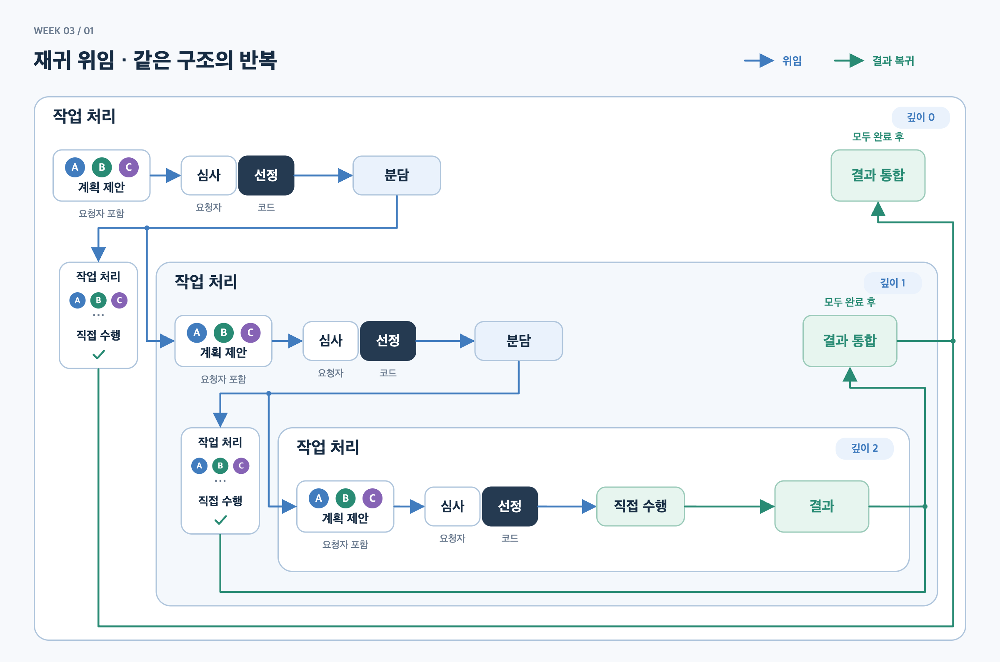

# Week 03 — 계획 심사와 재귀·병렬 위임

비결정적인 LLM의 계획을 **고정된 선정 규칙·의존성·출력 검증**으로 어디까지 통제할 수 있는지 실험했다. 본문은 최신 peer DAG 실험만 다루며, 이전 배정 실험은 [별도 CSV](results-allocation-reference.csv)에 보존했다.

## 1. 설정

- **작업:** 출시 검토, 게임 기획·코드 구조, 결제 재설계, 사업 확장, 출시 운영의 5개. 사전 gold는 [tasks.json](tasks.json)에 기록했다.
- **에이전트:** A 기술, B 사업·분석, C 운영. 작업별 요청자가 관리자 역할을 맡으며, 요청자도 계획을 내고 자기 계획을 심사한다. 낙찰자는 하위 작업의 요청자가 될 수 있다. 단일 Python 런타임이 상태를 관리한다.
- **선정:** 요구 충족·실행·검증 가능성을 각각 0~2점으로 심사한다. 모두 1점 이상인 후보 중 **합계 → 확신도 → 고정 순서**로 선정한다. 심사 때 확신도는 숨긴다.
- **조건:** baseline은 전문성 분리, homogeneous는 모두 일반 역할, overconfident는 baseline의 C에게 모든 작업에 확신도 95 이상으로 입찰하도록 지시한다. 나머지 설정은 같다.
- **모델:** OpenRouter / Fireworks / `deepseek/deepseek-v4.1-flash`, temperature=0, reasoning off. `response_format=json_schema`, strict=true. 출력 토큰 상한 필드는 보내지 않는다. 최대 깊이 5, 동시 호출 3, 장기 메모리 없음.

[프롬프트](extensions/peer_dag/models.py) · [재귀·상태 도식](diagrams/CURRENT_STATES.md) · [설치와 재현](README.md). 새 실험 명령: `python3 submissions/26622007/week-03/extensions/peer_dag/suite_study.py run`.

## 2. 결과

동일한 **5개 작업 × 3조건 × 3회 = 45개 작업의 최종 결과이며, 429 복구를 포함**한다. [results.csv](results.csv)는 최초 45회와 복구 16회의 실제 시도를 모두 보존한 61행이다. 아래 표는 작업별 완료 결과를 한 번씩 집계했다. **정답·오배정은 최초 책임자와 gold의 비교**, 메시지는 완료 시도의 하위 작업까지 포함한 공고+유효 입찰+낙찰 수다.

<!-- submission-results:start -->
|회차|조건|완료/작업|정답|오배정|미배정|메시지|429 복구|
|---:|---|---:|---:|---:|---:|---:|---:|
|1|baseline|5/5|2|3|0|133|2|
|1|homogeneous|5/5|2|3|0|105|2|
|1|overconfident|5/5|1|4|0|189|2|
|2|baseline|5/5|3|2|0|119|0|
|2|homogeneous|5/5|2|3|0|56|0|
|2|overconfident|5/5|1|4|0|119|0|
|3|baseline|5/5|2|3|0|119|3|
|3|homogeneous|5/5|2|3|0|140|3|
|3|overconfident|5/5|2|3|0|154|4|
<!-- submission-results:end -->

**45/45 문서 생성, 44/45 필수 facts 통과, 26/45 실제 실행 중첩, 관측 최대 깊이 2**였다. 429는 통신 예외로 복구했으며, 원래 중단된 16행은 수치를 공란으로 남겼다. 실패 시도의 부분 배정과 메시지 수는 note에 보존했다. [전체 시도·로그](submission/RESULTS_BY_RUN.md) · [집계 정의·검증](submission/README.md).

## 3. Smith (1980)와 비교

[Contract Net 원문](https://reidgsmith.com/The_Contract_Net_Protocol_Dec-1980.pdf)의 분산 센싱 예시와 비교했다. 페이지는 인쇄본 기준이다.

|항목|Smith의 분산 센싱 시스템|현재 구현|
|---|---|---|
|참여자|센서·처리 노드가 작업별로 manager/contractor 전환(p.1105)|A/B/C가 역할 전환; 스케줄러는 중앙 런타임|
|입찰 생성|거리로 공고를 평가하고 위치·센서 목록을 회신(pp.1105–1106)|LLM이 참여 여부·계획·근거·확신도 생성|
|입찰의 진실성|협력 노드의 능력 정보를 사용; 거짓 입찰 검증은 별도 제시하지 않음¹|계획 심사와 형식 검증은 있으나 자기 평가의 진실성 보장은 없음|
|배정 품질|센서의 영역·종류 분포와 통신 거리(pp.1105–1106)|최초 gold 일치와 최종 facts·문서 품질을 분리 평가|
|협상 비용|통신량·지연·부하 분산의 절충(pp.1106–1108)|재위임마다 협상 반복; 추가 심사·실행 호출도 발생|
|실패 방식|무응찰 원인 구분, 노드 장애 시 재공고(pp.1108–1111)|429 중단, 하위 실패 전파; 복구는 별도 실행|

¹ 입찰 진실성 행은 원문의 협력적 설정과 능력 정보 기반 절차(pp.1104–1107)에 대한 비교 해석이다. 강의 기본형에 재귀 위임·병렬 실행·계획 심사를 추가한 확장이며, Smith의 분산 하드웨어를 그대로 재현한 것은 아니다.

## 4. 해석

[기본 배정 실험과 비교](submission/COMPARISON.md)하면 gold 일치는 baseline 9→7, homogeneous 5→6, overconfident 3→4건(각 15건)으로, 전체 17/45는 같았다. 과신 조건에서 C가 13/15건을 가져갔으며 [심사 동점 때 확신도로 선정된 로그](extensions/peer_dag/logs/20260922T012131-no-token-limit-9703d2-r1-release-review-overconfident.jsonl#L30)가 그 영향을 보여준다. 확인된 확장은 실제 분담·검토·통합이다. 최종 문서 45개 외에 하위 산출물 117개가 생겼고, 게임 위임 사례는 직접 수행 사례에 없던 입력 큐·저장 마이그레이션 미확정 사항을 명시했다. 결제 위임 사례에서는 통합 단계가 하위 결과의 잘못된 백필 판단을 교정했다. 다만 최종 문서가 항상 길어지거나 누락이 해소된 것은 아니며, 단일 에이전트 대조 실험이 없어 품질 향상을 단정할 수 없다. 재귀 깊이는 40/45건이 0~1, 최대 2였다. 주어진 자료로 끝나는 작업의 제한된 복잡도와 얕은 계획 분해가 원인일 가능성이 있으나 복잡도를 바꾼 실험은 하지 않았다. 실행 병렬도는 26/45건에서 2 이상, 5건에서 설정 상한 3에 도달했으므로 낮은 복잡도만으로 설명할 수 없다. 고정 선정 규칙과 의존성은 통제했지만 LLM의 계획·심사·산출물까지 결정적으로 만들었다는 증거는 아니다.

*사용자가 설계와 실험 방향을 결정했고, Codex가 구현·집계·문헌 대조·문장 정리를 보조했다.*
