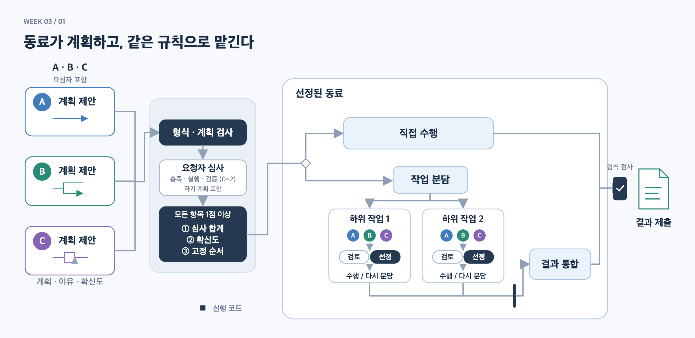
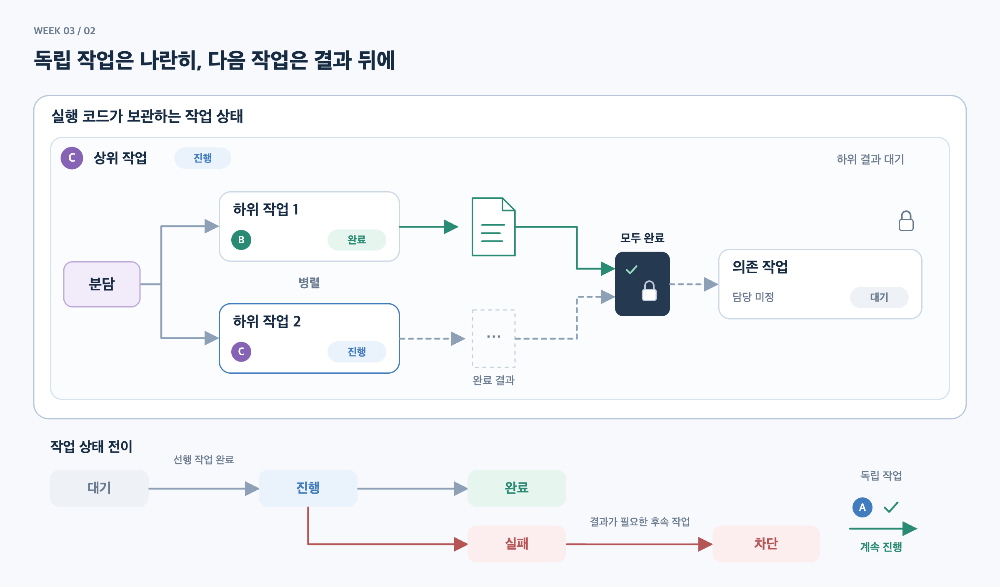

# 현재 코드의 에이전트 동작과 협업 상태

대상: `extensions/peer_dag`. 2026-09-22 현재 소스와 대조했다. 그림은 코드의 주요 흐름을 추상화한 것으로, 특정 실험 로그의 재현 화면이 아니다.

## 1. 재귀 위임: 같은 구조가 작업 안에서 반복된다


[편집 가능한 SVG](agent-state-overview.svg)

**같은 ‘작업 처리’ 틀을 세 겹으로 중첩**했다. 각 층에서 `계획 제안 → 심사 → 선정`이 반복된다. 파란 경로는 하위 작업 호출, 초록 경로는 완료 결과의 반환이다. 직접 수행하는 가장 안쪽 작업에서 내려가는 흐름이 끝나고, 결과가 상위 통합 단계로 돌아온다.

옆의 작은 작업 카드는 같은 절차를 접어 표시한 독립 형제 작업이다. 상위 작업은 두 하위 결과를 모두 받은 후 통합한다. 그림은 깊이 2에서 직접 수행을 선택한 예시이며, 현재 설정의 최대 깊이 5를 뜻하는 그림은 아니다. 재귀는 `solve() → run_graph() → 하위 solve()`로 구현되어 있다.

선정된 동료는 하위 작업의 요청자가 되어 같은 절차를 사용한다. 짙은 선정 상자는 실행 코드, 흰 심사 상자는 요청 동료의 LLM 판단이다. 형식 검사·선정 우선순위·직접 수행과 분담의 선택은 아래 상세 도식에 따로 표시했다.

<details>
<summary>계획 심사·선정 규칙과 실행 분기 상세</summary>



[상세 도식 SVG](agent-selection-detail.svg)

</details>

**현재 구현은 요청자도 계획을 제안하고 자신의 계획까지 심사한다.** 요청자(해당 작업의 관리자 역할)를 제안 후보에서 제외하지 않는다. 심사 때 후보의 확신도는 가리며, 요구사항 충족도·실행 가능성·검증 가능성을 각각 0~2점으로 평가한다.

각 에이전트는 **계획 제안 → 선정되면 직접 수행 또는 분담 → 분담했다면 결과 대기·통합 → 제출**의 흐름을 사용한다. 미선정 에이전트는 해당 작업을 실행하지 않지만, 다른 작업의 제안·심사·실행에는 참여할 수 있다. 고정된 관리자 전용 에이전트는 없다.

이는 설명을 위한 동작 단계다. 실제 코드에 에이전트별 `Worker.state` 열거형이나 지속되는 대화 상태가 있는 것은 아니다. 작업별 `solve()` 호출과 `propose`, `review`, `execute`, `synthesize` 단계로 구현한다. [동작 구현](../extensions/peer_dag/core.py#L272)

## 2. 독립 작업은 나란히, 다음 작업은 결과 뒤에



[편집 가능한 SVG](collaboration-state-overview.svg)

상태는 **작업에 붙고 실행 코드가 보관**한다. 예시에서 상위 C 작업은 하위 결과를 기다리면서도 전체 상태는 진행 중이다. 하위 C 작업은 별도 작업 세션이므로 처리할 수 있다. 후속 작업은 필요한 두 결과가 모두 완료되어야 시작되며, 대기 중에는 아직 담당자가 선정되지 않았다.

하단의 실패에서 차단으로 향하는 화살표는 **서로 다른 작업 사이의 영향**이다. 실패한 작업 자체가 차단 상태로 바뀌는 것은 아니다.

|그림의 상태|실제 표현|전환 조건|
|---|---|---|
|대기|`run_graph()`의 `pending`|필요한 선행 작업이 모두 성공하면 시작. 선행 작업이 없는 작업은 바로 시작 가능|
|진행|`running`에 등록된 `solve()` Future|계획·심사·실행·하위 결과 대기를 포함. API 호출 중인 상태만 뜻하지 않음|
|완료|`Outcome.status = "succeeded"`|직접 수행 또는 통합 결과의 로컬 형식 검사를 통과|
|실패|`Outcome.status = "failed"`|유효 제안 없음, 심사 탈락, 실행 예외, 하위 작업 실패·차단 등|
|차단|`Outcome.status = "blocked"`|필요한 선행 작업이 실패·차단되어, 해당 작업을 시작하지 않음|

의존 작업에는 선언한 선행 작업의 **완료 산출물**을 전달한다. 상위 작업의 통합 단계에는 하위 산출물을 모아서 전달한다. 진행 중 대화 전체를 공유하지 않는다. 독립 작업은 다른 작업의 실패와 관계없이 계속 처리하며, 하위 실행이 정리된 뒤 상위 작업은 실패로 끝난다. [스케줄링과 상태 이동](../extensions/peer_dag/core.py#L335), [상위 결과 통합](../extensions/peer_dag/core.py#L304)

## 그림에서 생략한 구현 경계

- **결정성의 범위:** 코드가 고정하는 것은 검증·선정·실행 순서의 규칙이다. 계획과 심사 점수는 LLM이 만든다. 모든 심사 항목이 1점 이상인 후보 중 `심사 합계 내림차순 → 확신도 내림차순 → 고정 순환 순서`로 선정한다. 루트의 순서는 요청자부터 시작하며, 하위 작업은 요청자와 승인된 계획의 작업 순서로 회전 순서를 정한다. 응답 도착 순서로 동점을 깨지 않는다. 통과 후보가 없으면 작업은 실패한다. 같은 제안과 점수에는 같은 선택이 나오지만, 제안과 점수 자체가 매번 같다는 보장은 없다. [선정 규칙](../extensions/peer_dag/core.py#L154), [하위 작업의 동점 순서](../extensions/peer_dag/core.py#L335)
- **동시 실행 제어:** 전역 API 슬롯, `(작업 ID, Worker)` 세션 잠금, 논리적 자원의 읽기·쓰기 충돌 검사를 적용한다. 독립 작업도 호출 슬롯이나 자원이 없으면 기다린다. 부모는 하위 결과를 기다리는 동안 실행 자원 잠금을 잡지 않는다. [자원 잠금](../extensions/peer_dag/core.py#L192), [호출 제어](../extensions/peer_dag/core.py#L235)
- **완료와 정답:** `succeeded`는 산출물 생성과 로컬 형식 검사를 통과했다는 뜻이다. 사실의 정확성은 실행 후 별도로 평가한다. [산출물 검사](../extensions/peer_dag/core.py#L173), [사후 평가](../extensions/peer_dag/core.py#L377)
- **수명과 취소:** 상태는 한 실행의 `Runtime` 메모리에 있다. 현재 CLI는 장기 메모리를 연결하지 않는다. 실행 중 취소는 일반 실패와 달리 `CancelledError`를 전파하고 남은 하위 Future를 정리한다. 그림은 이 취소 경로와 HTTP 재시도를 생략했다. 로그 저장이 중단 지점부터의 자동 재개를 뜻하지는 않는다. [Runtime](../extensions/peer_dag/core.py#L222), [취소 전파](../extensions/peer_dag/core.py#L326)

## 원본과 재생성

`build_state_overviews.cjs`가 SVG와 PNG를 생성한다. Node.js와 Playwright, 로컬 Chromium 계열 브라우저가 필요하다. 설치된 Chrome을 쓸 경우:

```bash
DIAGRAM_CHROME='/Applications/Google Chrome.app/Contents/MacOS/Google Chrome' \
node submissions/26622007/week-03/diagrams/build_state_overviews.cjs
```

`state-overviews-render-check.json`은 카드와 캔버스의 텍스트 넘침 검사 결과다. 재귀 개요·선정 상세·협업 상태 PNG에서 한글, 분기·합류, 중첩 구조와 결과 반환, 상태 표시를 시각적으로 확인했다. 첫 상세 도식의 한글 넘침 기록은 [첫 렌더 로그](../logs/20260922-state-diagram-first-render.json)에 보존했다.
