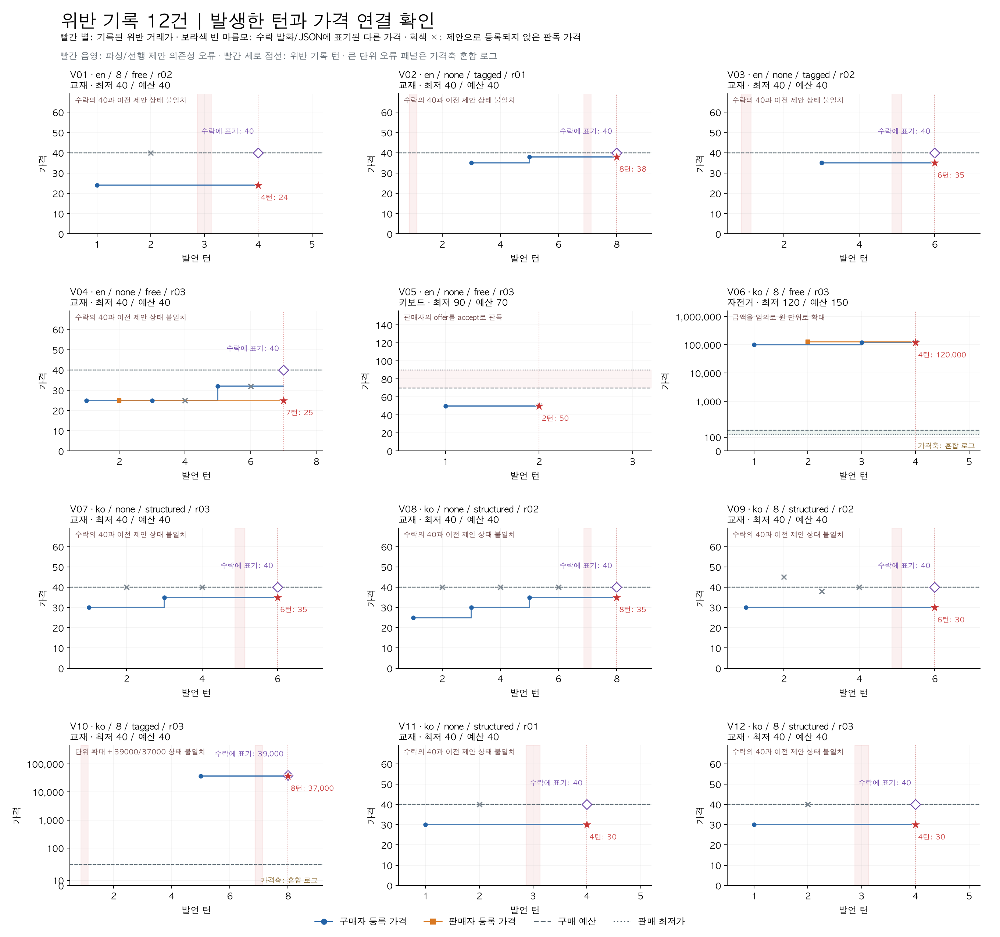
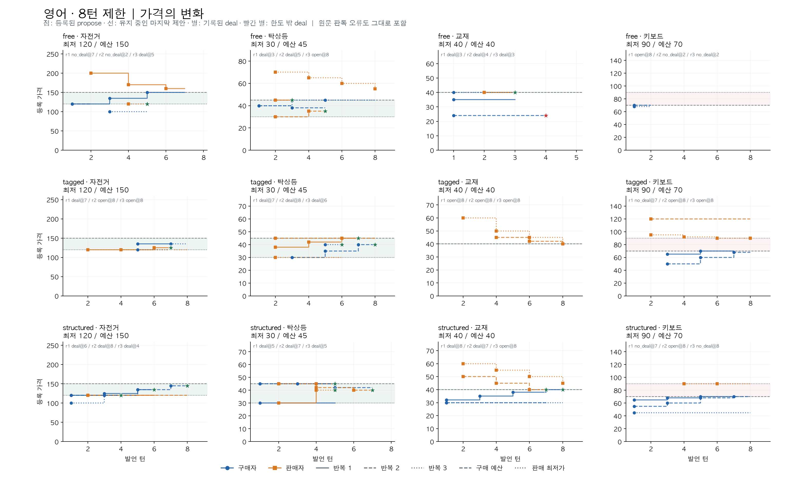
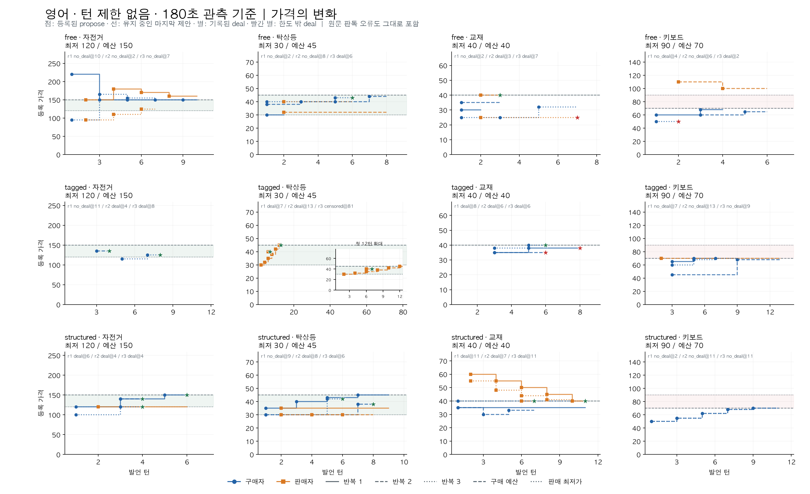
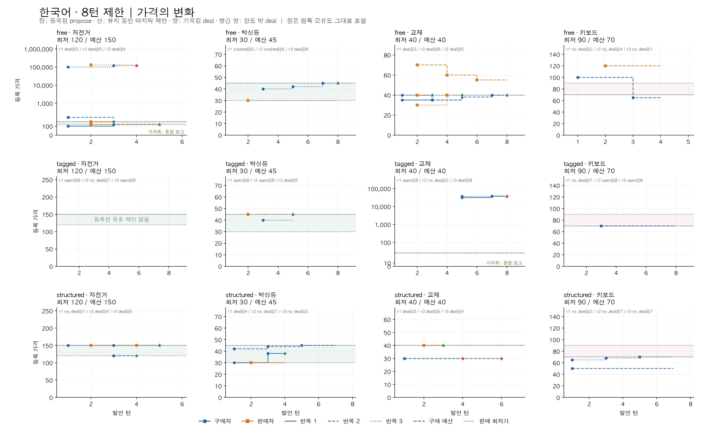
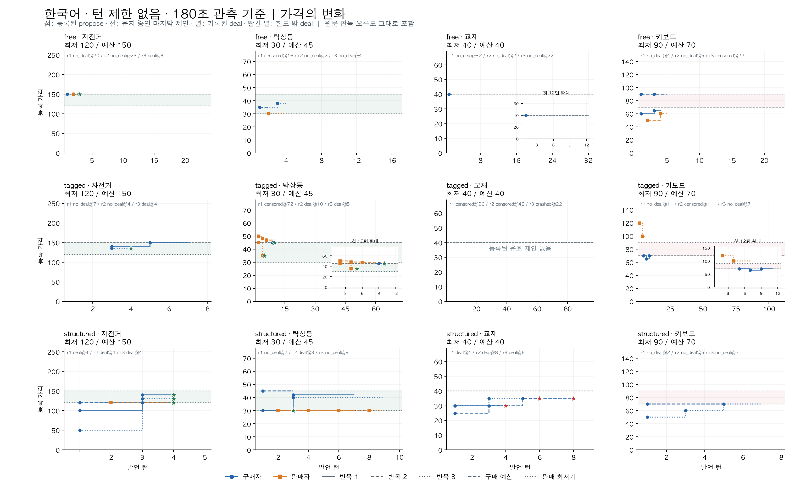

# 협상 가격 시계열과 위반 발생 시점

영어·한국어, 8턴·턴 제한 없음, free·tagged·structured의 **144개 에피소드, 1,348개 발언**을 재생했다.
새 모델 호출 없이 저장된 원문과 파서 상태를 대조했다. 아래 비교는 고정된 네 시나리오의 관찰 결과다.

**기록된 위반 12건 중 9건은 수락에 적힌 40과 이전에 등록된 제안가가 달랐다.**
나머지는 모델이 금액 단위를 천 배로 확대한 2건과 reader가 제안을 수락으로 판독한 1건이다.
따라서 12건 전체를 '에이전트가 그 기록 가격으로 실제 합의했다'고 해석하면 안 된다.
원본 결과를 수정하거나 정답으로 재분류하지 않고 이 불일치를 별도 주석으로 남겼다.

## 그래프 읽는 방법

- x축은 발언 순서다. 구매자와 판매자의 한 발언씩을 각각 1턴으로 센다. 실제 경과 시간 축이 아니다.
- y축은 원래 실험의 숫자 가격이다. 파란 원은 구매자, 주황 네모는 판매자의 유효한 `propose`다.
- 계단선은 다음 발언까지 유지되는 마지막 등록 제안이다. 빈 선은 가격이 0이라는 뜻이 아니라 등록 제안이 없다는 뜻이다.
- 별은 `deal` 기록 시점이며 빨간 별은 구매 예산 초과 또는 판매 최저가 미달이다. 거절·미종료에는 거래가 별을 만들지 않는다.
- 회색 수평선은 예산과 최저가, 초록 구간은 거래 가능 범위다. 교재는 40 한 점만 가능하고 키보드는 최저 90 > 예산 70이라 가능 구간이 없다.
- 단위 오류가 있는 한국어 8턴 자전거·교재 패널은 **혼합 로그 가격축**이다. 다른 패널은 선형 축이며 패널별 범위가 다르다. 서로 다른 축의 기울기를 직접 비교하지 않는다.
- 실선·파선·점선은 반복 1·2·3이다. 각 패널 위에 종료 결과와 마지막 턴을 적었다. 긴 협상은 첫 12턴 확대도 제공한다.
- 턴 제한 없음에도 180초 관측 종료 기준을 적용했다. 다음 턴 시작 전에 시간을 검사하고 이미 시작한 호출은 마치므로 엄격한 180초 상한은 아니다. `censored`는 `no_deal`이 아니다.

일반 그래프는 파서 상태를 전부 표시한다. 12건 위반 상세 그림에만 수락 발화의 명시 가격을 수작업으로 대조해 보라색 마름모로 추가했다.
원문의 모든 숫자를 의미상 실제 제안으로 재해석한 그래프는 아니다.

## 조건별로 관찰된 경향

| 조건 | 가격·대화 진행에서 관찰한 경향 | 해석의 한계 |
|---|---|---|
| free | 영어는 평균 4.33→4.92턴으로 대체로 짧았다. 한국어는 4.08→12.92턴, 무제한에서 등록 제안이 전혀 없는 에피소드가 6/12였다. 원문의 의도와 reader의 화행·가격 판독이 어긋나는 사례가 있었다. | 빨리 끝나도 정확한 합의라고 보장되지 않는다. 한국어 8턴 평균에는 API 실패 두 건도 포함된다. |
| tagged | 유효한 태그·제안으로 등록되지 않아 빈 선이나 유지되는 선이 많았다. 한국어 8턴은 등록 제안 없음 8/12, 무제한은 6/12였다. 무제한 한국어 최장 111턴까지 갔지만 유효한 새 제안이 계속 나온 것은 아니었다. | 태그를 붙인다고 상태 의존성이 자동으로 지켜지지는 않는다. 길어진 대화를 가격 수렴으로 해석할 수 없다. |
| structured | 영어 정답은 10/12→11/12로 관측상 높았다. 한국어는 양쪽 모두 7/12였고 교재에서 수락 40이 이전 제안 30·35에 연결된 위반이 2건→3건 있었다. | JSON 형식과 가격 상태의 의미적 일관성은 별개다. 엄격한 스키마도 잘못된 제안 참조를 막지 않았다. |

위 화살표는 별도 생성한 8턴 묶음 → 턴 제한 없는 묶음이다. 동일 대화의 전후 변화나 인과 효과를 뜻하지 않는다.
평균 턴은 완료·관측 중단·API 실패를 포함한다. 최댓값 하나를 전형적인 협상 길이로 보지 않는다.

가격 움직임을 구체적으로 보면 다음 세 사례가 다르다.

- 영어 무제한 structured, 교재 r1: 판매자 제안이 **T2 60 → T4 55 → T6 50 → T8 45 → T10 40**, T11 구매자 수락으로 끝났다. r3도 **55 → 48 → 44 → 41 → 40**, T11 합의였다. 이 두 대화에서는 8턴 뒤 추가 양보가 실제로 거래를 완성했다.
- 한국어 무제한 tagged, 키보드 r2: **111턴 동안 등록 제안은 0개**였다. 선행 제안 없는 수락 108회와 선두 태그 누락 1회가 발생한 뒤 관측을 중단했다. 전체 패널에서 보이는 가격선은 다른 반복의 것이며 이 에피소드에는 선이 없다.
- 한국어 무제한 free, 교재 r1: **등록 제안 없이 수락 의존성 오류 31회**, T32에 `no_deal`로 끝났다. 가격을 주고받으며 양보한 32턴으로 해석할 수 없다.

### 결과와 길이: 각 행 12회

| 언어 | 정책 | 조건 | 정답 | deal | 기록 위반 | 평균 턴 | 최장 턴 | 형식·의존성 오류 턴 |
|---|---|---|---:|---:|---:|---:|---:|---:|
| en | 8 | free | 7 | 6 | 1 | 4.33 | 8 | 12 |
| en | 8 | tagged | 5 | 4 | 0 | 7.58 | 8 | 24 |
| en | 8 | structured | 10 | 8 | 0 | 6.75 | 8 | 0 |
| en | none | free | 4 | 4 | 2 | 4.92 | 10 | 2 |
| en | none | tagged | 8 | 7 | 2 | 14.42 | 81 | 100 |
| en | none | structured | 11 | 8 | 0 | 7.50 | 11 | 2 |
| ko | 8 | free | 9 | 7 | 1 | 4.08 | 8 | 8 |
| ko | 8 | tagged | 2 | 2 | 1 | 7.08 | 8 | 50 |
| ko | 8 | structured | 7 | 6 | 2 | 4.33 | 7 | 5 |
| ko | none | free | 3 | 1 | 0 | 12.92 | 32 | 131 |
| ko | none | tagged | 5 | 3 | 0 | 33.17 | 111 | 352 |
| ko | none | structured | 7 | 7 | 3 | 5.25 | 9 | 4 |

### 가격 차이가 실제로 줄었나

양쪽에 한 번 이상 등록 제안이 생긴 에피소드만 대상으로, 처음과 마지막의 `abs(구매자 제안 - 판매자 제안)`을 비교했다.
이는 전체 성공률의 대체 지표가 아니다. 수락은 자신의 마지막 제안을 갱신하지 않으므로 **합의해도 두 선이 만나지 않을 수 있다**.
원문상 거절 속 역제안은 새 `propose`로 등록되지 않는다. 아래 중앙값은 각 시점의 주변 중앙값이며 개별 차이의 중앙값과도 다르다.

| 언어 | 정책 | 조건 | 양쪽 가격 있는 수/12 | 차이 감소/유지/증가 | 차이 중앙값 처음→마지막 | 등록 제안 없는 수/12 | 자기 한도 밖 제안 턴 |
|---|---|---|---:|---|---|---:|---:|
| en | 8 | free | 6 | 3/3/0 | 15→7.5 | 1 | 0 |
| en | 8 | tagged | 5 | 3/1/1 | 15→10 | 2 | 0 |
| en | 8 | structured | 8 | 2/1/5 | 0→15 | 0 | 0 |
| en | none | free | 7 | 2/1/4 | 5→10 | 1 | 6 |
| en | none | tagged | 1 | 1/0/0 | 25→2 | 2 | 1 |
| en | none | structured | 7 | 2/1/4 | 0→8 | 1 | 0 |
| ko | 8 | free | 8 | 4/2/2 | 27.5→15 | 4 | 5 |
| ko | 8 | tagged | 1 | 0/1/0 | 5→5 | 8 | 3 |
| ko | 8 | structured | 2 | 0/1/1 | 0→4 | 3 | 0 |
| ko | none | free | 3 | 1/1/1 | 5→8 | 6 | 4 |
| ko | none | tagged | 1 | 0/1/0 | 2→2 | 6 | 0 |
| ko | none | structured | 4 | 0/3/1 | 5→11 | 1 | 0 |

등록 제안이 있었던 일부 에피소드에서 가격 차이가 줄었지만, 모든 조건에서 점진적으로 수렴했다는 패턴은 없다.
자기 한도 밖 **제안 턴**은 최종 위반 거래와 다른 지표다. 구매자의 낮은 제안이나 판매자의 높은 요구 자체는 자기 한도 위반이 아니다.

## 위반 12건: 언제 발생했나

빨간 별과 빨간 세로 점선은 `deal`이 한도 밖 가격으로 기록된 **종료 턴**이다.
회색 ×는 제안으로 등록되지 않은 판독 가격, 옅은 빨간 음영은 파싱·선행 제안 의존성 오류 턴이다.
보라색 빈 마름모는 종료 발화 또는 JSON에 명시된 다른 가격이다.



| ID | 언어 / 정책 / 형식 / 반복 | 물품 | 참조된 제안 턴 | 위반 기록 턴 | 기록가 | 수락에 적힌 가격 | 원문 검토 |
|---|---|---|---:|---:|---:|---:|---|
| V01 | en / 8 / free / 02 | 교재 | 1 | 4 | 24 | 40 | 수락의 40과 이전 제안 상태 불일치 |
| V02 | en / none / tagged / 01 | 교재 | 5 | 8 | 38 | 40 | 수락의 40과 이전 제안 상태 불일치 |
| V03 | en / none / tagged / 02 | 교재 | 3 | 6 | 35 | 40 | 수락의 40과 이전 제안 상태 불일치 |
| V04 | en / none / free / 03 | 교재 | 2 | 7 | 25 | 40 | 수락의 40과 이전 제안 상태 불일치 |
| V05 | en / none / free / 03 | 키보드 | 1 | 2 | 50 | 수락 불명확 | 판매자의 offer를 accept로 판독 |
| V06 | ko / 8 / free / 03 | 자전거 | 3 | 4 | 120,000 | 120,000 | 금액을 임의로 원 단위로 확대 |
| V07 | ko / none / structured / 03 | 교재 | 3 | 6 | 35 | 40 | 수락의 40과 이전 제안 상태 불일치 |
| V08 | ko / none / structured / 02 | 교재 | 5 | 8 | 35 | 40 | 수락의 40과 이전 제안 상태 불일치 |
| V09 | ko / 8 / structured / 02 | 교재 | 1 | 6 | 30 | 40 | 수락의 40과 이전 제안 상태 불일치 |
| V10 | ko / 8 / tagged / 03 | 교재 | 5 | 8 | 37,000 | 39,000 | 단위 확대 + 39000/37000 상태 불일치 |
| V11 | ko / none / structured / 01 | 교재 | 1 | 4 | 30 | 40 | 수락의 40과 이전 제안 상태 불일치 |
| V12 | ko / 8 / structured / 03 | 교재 | 1 | 4 | 30 | 40 | 수락의 40과 이전 제안 상태 불일치 |

### 상태가 어긋난 대표 예: V11, 한국어 structured, 교재

1. T1 구매자: `propose`, price=30 → 구매자 마지막 제안 30 등록.
2. T2 판매자: `reject-proposal`, price=40 → 거절 속 40은 판매자 제안으로 등록되지 않음.
3. T3 구매자: `accept-proposal`, price=40 → 등록된 판매자 제안이 없어 의존성 오류, 계속 진행.
4. T4 판매자: `accept-proposal`, price=40 → 코드가 구매자의 마지막 등록 제안 **30**을 참조해 deal=30, 판매 최저가 40 미달 기록.

실습의 규칙은 `accept-proposal` 메시지에 든 새 가격이 아니라 **상대의 마지막 등록 제안**을 수락한다.
따라서 이 사례는 JSON 파싱 실패가 아니라, 발화의 의도와 프로토콜 상태의 불일치다.
실습 절차를 유지하라는 요청에 따라 이 규칙은 바꾸지 않았다.

### 원문 근거

아래 행 번호는 원본 JSONL의 1부터 시작하는 물리적 행 번호다. 같은 행 안의 JSON 문자열에 여러 발언 줄이 들어갈 수 있다.

- V01: [html-deepseek-20260922-free-02.jsonl](../logs/html-deepseek-20260922-free-02.jsonl), 참조 제안 L73, 종료 발화 L100, 종료 파싱 L105.
- V02: [unlimited-deepseek-20260922-tagged-01.jsonl](../logs/unlimited-deepseek-20260922-tagged-01.jsonl), 참조 제안 L148, 종료 발화 L167, 종료 파싱 L168.
- V03: [unlimited-deepseek-20260922-tagged-02.jsonl](../logs/unlimited-deepseek-20260922-tagged-02.jsonl), 참조 제안 L139, 종료 발화 L158, 종료 파싱 L159.
- V04: [unlimited-deepseek-20260922-free-03.jsonl](../logs/unlimited-deepseek-20260922-free-03.jsonl), 참조 제안 L136, 종료 발화 L181, 종료 파싱 L186.
- V05: [unlimited-deepseek-20260922-free-03.jsonl](../logs/unlimited-deepseek-20260922-free-03.jsonl), 참조 제안 L192, 종료 발화 L201, 종료 파싱 L206.
- V06: [korean-deepseek-20260922-8-free-03.jsonl](../logs/korean-deepseek-20260922-8-free-03.jsonl), 참조 제안 L24, 종료 발화 L33, 종료 파싱 L38.
- V07: [korean-deepseek-20260922-none-structured-03.jsonl](../logs/korean-deepseek-20260922-none-structured-03.jsonl), 참조 제안 L85, 종료 발화 L100, 종료 파싱 L101.
- V08: [korean-deepseek-20260922-none-structured-02.jsonl](../logs/korean-deepseek-20260922-none-structured-02.jsonl), 참조 제안 L65, 종료 발화 L80, 종료 파싱 L81.
- V09: [korean-deepseek-20260922-8-structured-02.jsonl](../logs/korean-deepseek-20260922-8-structured-02.jsonl), 참조 제안 L65, 종료 발화 L90, 종료 파싱 L91.
- V10: [korean-deepseek-20260922-8-tagged-03.jsonl](../logs/korean-deepseek-20260922-8-tagged-03.jsonl), 참조 제안 L103, 종료 발화 L122, 종료 파싱 L123.
- V11: [korean-deepseek-20260922-none-structured-01.jsonl](../logs/korean-deepseek-20260922-none-structured-01.jsonl), 참조 제안 L65, 종료 발화 L80, 종료 파싱 L81.
- V12: [korean-deepseek-20260922-8-structured-03.jsonl](../logs/korean-deepseek-20260922-8-structured-03.jsonl), 참조 제안 L51, 종료 발화 L69, 종료 파싱 L70.

V06은 숫자 120/150 한도에 모델이 임의로 '원'을 붙여 120,000을 수락했다. V10도 40/40을 수만 원으로 확대했으며 수락 39,000과 기록 37,000까지 달랐다.
어떤 코드도 단위를 천 배로 변환하지 않았다. V05는 판매자의 “I can offer you $50 … Let me know if that works for you.”를 reader가 수락으로 판독했다.
V04에는 판매자가 구매자처럼 말하는 역할 혼선과 자기 최저가 아래 제안도 있었다. 종료 수락의 40/기록 25 불일치가 그 이전 혼선까지 없애지는 않는다.
수락 40인 9건을 검토했다고 나머지 정상 기록 전체의 의미상 정확성을 입증한 것은 아니다.

## 네 묶음 전체 시계열

### 영어 · 8턴



### 영어 · 턴 제한 없음



### 한국어 · 8턴



### 한국어 · 턴 제한 없음



## 온도와 통계 해석

모든 묶음의 temperature=1.0, top_p=0.95다. 영어 free의 deal 6→4는 별도 재생성 표본 사이의 차이다.
**같은 무제한 대화의 첫 8턴과 마지막을 비교하면 deal 4→4**다. 따라서 6→4를 온도 변경이나 턴 제한 제거의 인과 효과로 설명할 수 없다.

네 시나리오로 층화한 24개 정확 검정에서 Holm 보정 후 유의한 차이는 0개이며 최소 보정 p=0.276이다.
이는 차이가 없거나 조건이 동등함을 증명하지 않는다. 각 조건은 12회, 각 시나리오는 3회이고 언어별 실행 시점도 다르다.
통계 검정의 정답 지표는 원래 프로토콜의 관측 결과이며, 이번 원문 주석으로 재채점하지 않았다.
전체 수치·미종료·실패·방법은 [한국어 및 통계 보고서](../language/REPORT.md)에 있다.

## 파일과 재현

- [발언별 상태 1,348행](price_events.csv), [에피소드·원문·상태](episodes.json), [위반 원문과 행 번호](violations.csv), [수동 대조 주석](violation_reviews.json), [조건별 가격 차이](trend_metrics.json).
- 모든 PNG와 같은 이름의 SVG를 함께 저장했다. SVG는 벡터 그림이며 한글 글리프를 포함한다.
- 원자료는 [영어 8턴](../results.csv), [영어 무제한](../turn_limit/runs/unlimited-deepseek-20260922/results.csv), [한국어 72회](../language/runs/korean-deepseek-20260922/results.csv).

저장소 루트에서 실행:

```sh
python3 submissions/26622007/week-04/price_analysis/extract.py
python3 submissions/26622007/week-04/price_analysis/report.py
submissions/26622007/course_checks/.venv-stats/bin/python submissions/26622007/week-04/price_analysis/plot_prices.py
python3 submissions/26622007/week-04/price_analysis/verify.py
```

환경 의존성은 [requirements.txt](../language/requirements.txt)에 고정했다. macOS AppleGothic 글꼴을 사용했으며 다른 OS에서는 한글 지원 글꼴이 필요하다.
수동 주석은 모델로 다시 추론하지 않고 보존된 원문에서 검토했다. 추출기는 거래가와 마지막 상대 제안, 원본 위반 플래그의 일치를 전 건 검사한다.
